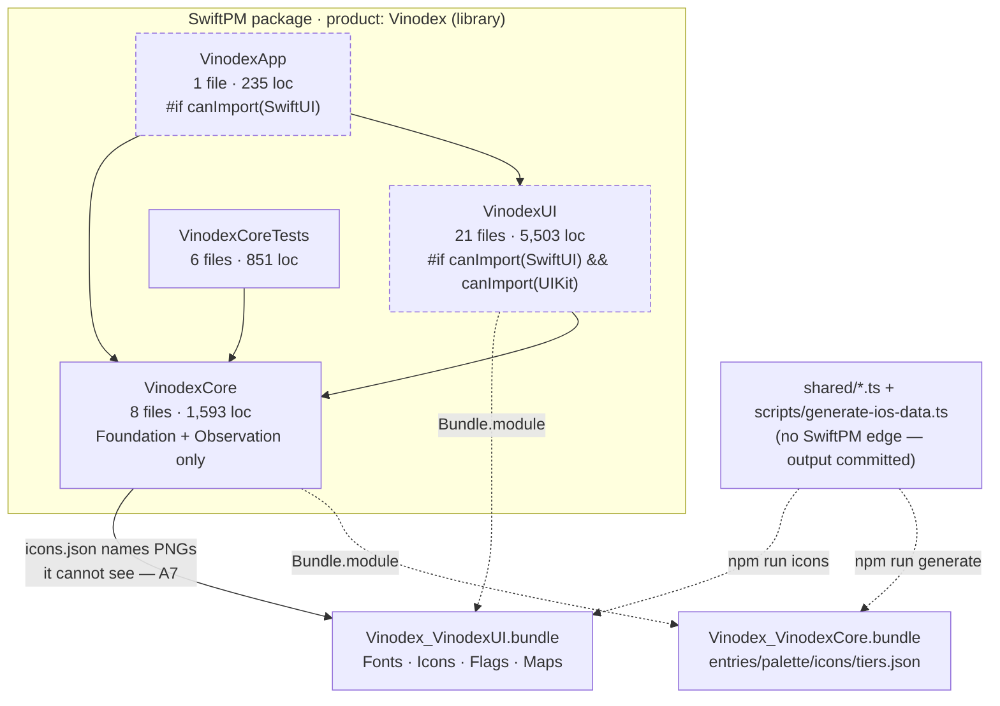
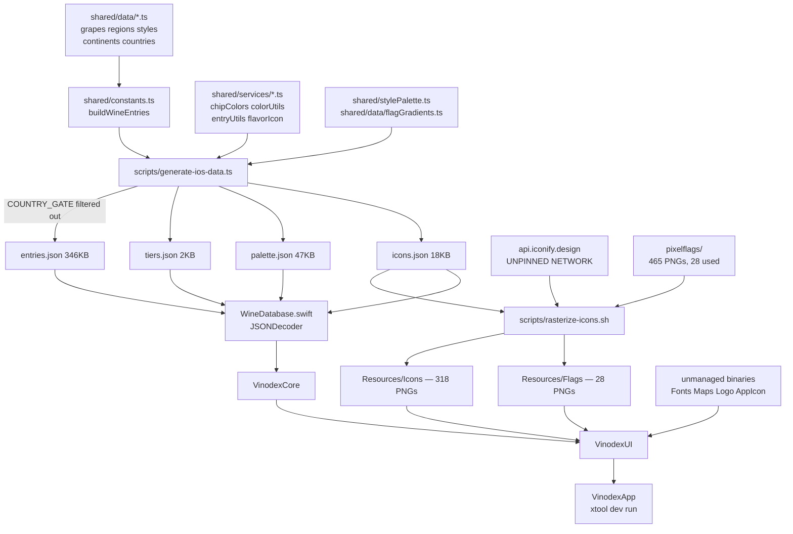

# Vinodex — Architecture, Repository & Platform Audit

**2026-07-28** · audited at `640efe9` (branch `audit`), with `upstream/main` at `2cae512`.
Four parallel audits: git history & hygiene, GitHub & remote topology, Swift module
architecture, build & data pipeline.

Companion to [AUDIT.md](AUDIT.md), which covers code-level defects (97 findings, IDs
`H1`–`H11`, `M1`–`M44`, `L1`–`L42`). This document covers the layer beneath it —
the repository, the platform, the package structure, and the pipeline. Where a
finding here overlaps one there, the existing ID is cited rather than restated.

IDs here are stable and namespaced: **X** blocking · **R** repository/git ·
**P** platform/GitHub · **A** architecture · **B** build/pipeline.

---

## Verdict

**The repo is buildable but not governable.** The code inside it is in better shape
than the machinery around it. Three things are true at once and they contradict each
other:

1. The repo is **functionally self-contained** — proven, not assumed. An agent copied
   only `shared/`, `scripts/`, `pixelflags/`, `package.json`, `tsconfig.json` and
   `Package.swift` into an empty directory, ran the generator with zero installed
   dependencies, and all four JSON files came out **byte-identical** to the committed
   ones. No relative import escapes the repo root.
2. The repo is **still being overwritten by a publish script** — confirmed live, see
   **X1** below.
3. **Nothing verifies anything.** No CI, no type-check, no regeneration check, no
   compile gate covering 78% of the source. Every guarantee in the README is a
   discipline a human is asked to remember.

The first is an achievement. The second makes work done here disposable. The third
means neither of you would find out.

---

## X1 · The publish path is live, and it will overwrite the audit — **Blocking**

This settles the open question at [AUDIT.md](AUDIT.md) lines 43–48, and it contradicts
what blaikooz reported. The evidence is written by the script itself.

While this audit ran, `upstream/main` advanced from `fb5dcf2` to `2cae512` — three new
commits. Two carry machine-generated trailers:

```
30af72b feat(ios): v0.4.1 fast master search, settings grid, minigames hub
  Published from blaikooz/vinodex@82d69cab9c.
  Assembled by scripts/publish-swift.mjs — do not commit here directly.

df10904 fix(ios): STYLES tile uses the wine glass the web app actually uses
  Published from blaikooz/vinodex@f238c5fa68.
```

The third, `2cae512`, is the merge of **PR #1** — the audit — merged by blaikooz at
`2026-07-29T01:54:12Z` with `"reviews": []`.

So `AUDIT.md` now sits on a branch that `publish-swift.mjs` regenerates from a monorepo
that has never heard of it. `KNOWN-ISSUES.md:283` says it plainly: *"Never commit
directly in `vinodex-swift`; it gets overwritten."*

This is not a disagreement about workflow. It is a factual state of the tooling, and it
means every fix landed here is disposable until it changes.

**Three ways out, in order of how much they cost:**

| Option | What it takes | Trade-off |
|---|---|---|
| Preserve-list | Add `AUDIT.md`, `arch.md`, `.github/` to the publish script's keep-list | One-line change upstream; everything else still gets clobbered |
| Land fixes in the monorepo | Fixes go to `blaikooz/vinodex` under `ios/`; paths map 1:1 | Correct today, but needs access to a repo you have no fork of |
| Retire the publish | The plan already drafted — sever it, make this repo authoritative | The real fix; needs blaikooz to act on both repos |

Until one of these happens, treat the 88 open AUDIT items as **a written work order,
not a fix queue**. That framing costs nothing and survives either outcome.

**Secondary consequence:** `30af72b` (v0.4.1) touches `EncyclopediaListScreen.swift`,
`EntryFilter.swift`, `WineDatabase.swift`, `DexIcon.swift`, `DexTheme.swift` and
`SettingsPanel.swift` — the exact files behind **H2, H6, H8, H9, H11, M5, M44**. Those
findings need re-verification against `30af72b` before anyone acts on them.

---

## Findings at a glance

| Area | High | Medium | Low | Total |
|---|---:|---:|---:|---:|
| Blocking | 1 | — | — | 1 |
| Repository & git | 3 | 7 | 3 | 13 |
| GitHub & platform | 2 | 3 | 5 | 10 |
| Module architecture | 4 | 10 | 10 | 24 |
| Build & pipeline | 2 | 6 | 7 | 15 |
| **Total** | **12** | **26** | **25** | **63** |

Highest-leverage items, in the order they unblock each other:

1. **X1** — resolve the publish question. Everything else is provisional until then.
2. **A1** — a two-character fix that restores the test suite on macOS.
3. **P5 / A19 / B7** — one CI workflow. Precondition for safely touching 78% of the code.
4. **A17** — one `AppSettings` type; retires `M13`, `H3`'s residual hack, and half of `M27`.
5. **M36 / R10** — LICENSE and NOTICE. A public repo currently in breach of OFL and CC BY.

---

## 1 · Repository & git history

### R1 · 909 KB of the pack is icon variants no code loads — **High**

318 icon PNGs = 106 slugs × 3 scales. Measured: @1x 164.5 KB, @2x 351.6 KB, @3x 557.9 KB.
**H6** establishes that `DexIcon.swift:24` never selects a scale-matched variant, so every
glyph upscales from the 64px @1x. The git-side consequence is worse than the app-side one:
this is **31% of the entire 2.89 MiB pack**, and `rasterize-icons.sh` re-emits all three
scales on every run, so each icon change writes three blobs where one would do.

→ Resolve **H6** toward "stop shipping unused scales": drop @2x/@3x from the rasterizer
and `git rm` the 212 files. Pack drops to ~2.0 MiB.

### R2 · 813 PNGs, 87% binary pack, no asset policy — **High**

465 `pixelflags/` + 318 `Icons/` + 28 `Flags/` + logo + AppIcon, plus 2 TTFs and 1 JPG.
The icon and flag trees are *regenerated*, nothing prunes (**L17**: 21 orphans already
ship), and nothing bounds growth.

→ **Skip git-lfs** — the files are individually tiny (median icon <2 KB, pixelflags average
210 bytes) and LFS would add a smudge-filter cost per checkout for no size win. Write the
policy **L20** asks for instead: generated PNG trees are outputs; any single binary over
250 KB needs justification in the commit body; the rasterizer must prune orphans.

### R3 · No ignore rules for iOS signing material — **High**

`.gitignore` covers `.build/`, `.swiftpm/`, `DerivedData/`, `node_modules/`, `.DS_Store` —
but not `*.mobileprovision`, `*.p12`, `*.cer`, `*.certSigningRequest`, `*.ipa`, `*.dSYM/`,
or `.env`. This repo deploys via xtool with a free Apple profile, so provisioning material
is handled in this working directory. A stray `git add -A` commits a `.mobileprovision`,
which embeds the developer certificate and team ID.

This is the single most likely route by which a credential enters this repo.

→ Append those seven patterns.

### R4 · The commit `640efe9` is authored under a malformed email — **Medium**

```
author mirrorfarm <\342\200\234<redacted>@gmail.com\342\200\235> 1785289764 -0400
```

The address is wrapped in **U+201C/U+201D curly quotes** — smart-quote autocorrect leaked
into `git config user.email`. GitHub cannot attribute the commit to any account, and
`git shortlog` reports two identities where there is one person. It is now permanent in
`upstream/main` via `2cae512`. The address also differs from the real one, which has a dot.

→ Fix the config by typing (not pasting) the address, and add a `.mailmap` so `blame` and
`shortlog` collapse the malformed identity:

```bash
git config --global user.email '<your-real-address>'
```

### R5 · `640efe9 "audit1"` — empty subject and body for a 97-finding document — **Medium**

The one commit a reader most needs context for has none, and it is merged upstream.
Cannot be amended cleanly now.

→ Put the context in the PR description; adopt a commit template for future work.

### R6 · `AppIcon.png` is 929 KB, 33% of the pack, essentially uncompressed — **Medium**

Its `objectsize:disk` is **951,567 — larger than the raw blob**, meaning zlib found nothing
to squeeze. Re-deflating the existing IDAT at level 9 alone yields **818,509 bytes (−14%)**;
`oxipng -o max` typically reaches 30–40% on a 1024² image. Already **L20**; recorded here
with the measured headroom.

Note: recompressing does not reclaim the git bytes. The original stays in the pack forever
absent a history rewrite, which is not justified at this size.

### R7 · Fonts, icons and flags are redistributed publicly with zero license text — **Medium**

Two OFL fonts with no `OFL.txt`. 106 `game-icons--*` slugs (CC BY 3.0, attribution
required) with no NOTICE. `pixelflags/` — 465 files — with no LICENSE or README. No
top-level LICENSE, so GitHub reports `licenseInfo: null`, which means all rights reserved
by default on a repo that is published publicly.

Already **M36**. The addition here: the *distribution* breach is independent of what the
app displays. OFL §2 and CC BY 3.0 §4(c) are being breached at the repository level right now.

### R8 · Commit scope changed `(native)` → `(ios)` silently at `30af72b` — **Medium**

Any tooling keyed on scope breaks at that boundary. → Pick one, document it in the README.
`(ios)` matches the monorepo's `ios/` prefix.

### R9 · History is machine-replayed, not authored — **Medium**

27 of 28 commits have author date == committer date; five pairs share a timestamp to the
second. `git bisect` and `git blame` point at publish commits, not at the change that caused
a regression — real authorship lives upstream and is reachable only via the
`Published from blaikooz/vinodex@<sha>` trailer.

→ Keep that trailer mandatory; it is the only bridge. Note `2cae512` has no source SHA.

### R10 · Commit granularity is coarse — **Medium**

`9c319e0` is 42 files / +9,530 / −3,178 in one commit; `fb5dcf2` is 488 files; the root is
239 files. Three commits account for most churn, so nothing is revertable at a useful
granularity — reverting the v0.3.3 data drop also reverts two unrelated features. A property
of publish batching, not of the authors.

### R11 · `*.sh` lacks `eol=lf` — **Low**

README declares Linux/WSL as the dev environment; a Windows checkout with
`core.autocrlf=true` writes CRLF into `rasterize-icons.sh` and it dies with
`bad interpreter: /bin/bash^M`. → Add `*.sh text eol=lf` and `*.yml text eol=lf`.

### R12 · 100 `pixelflags/` paths contain spaces — **Low**

`pixelflags/North America/…` is consumed by a shell script that already has an
unquoted-glob surface. Combined with **L25**'s duplicated slug rule this is a latent
silent-missing-flag bug. → Verify quoting, or rename to `north_america/` to match the
lowercase-underscore convention the leaf directories already use.

### R13 · `package-lock.json` neither tracked nor ignored — **Low**

Its status is undeclared. → Commit it (tracked, not ignored) and add `.nvmrc`. See **B2**.

### Confirmed clean

Secrets: **zero hits** across all 28 commits for AWS keys, GitHub tokens, OpenAI keys,
Slack tokens and private-key headers; no `.env`, `.netrc` or keystore ever existed. The
4.5 MB copyrighted Sotheby's text noted at `KNOWN-ISSUES.md:284` is **absent from this
mirror** — the mirroring boundary held; the exposure is upstream only. Line endings: 64/64
tracked text files are LF in both index and worktree, zero CR bytes, no BOMs. Working tree
clean, no stashes, no submodules, no custom hooks, `garbage: 0`. `.gitattributes` classifies
every tracked binary correctly (verified with `git check-attr`). Delta compression works —
five historical `entries.json` versions totalling 1.1 MB raw compress to 50.2 KB. No
committed-then-deleted binary anywhere in history; `.DS_Store` was never committed, so
**L21**'s fix was preventive.

---

## 2 · GitHub & platform

### P1 · README declares the repo disposable while PRs merge into it — **High**

`README.md:6-9` says commits here "will be overwritten on the next publish — send changes
to the monorepo instead," three lines before `README.md:11-12` says "No part of the build
reaches outside it." Both cannot be true. PR #1 was merged into this repo anyway.

This is **X1** viewed from the documentation side. Whatever the answer, the README must
state it unambiguously — the current text guarantees that the two of you will silently
disagree about where work goes.

### P2 · No CI in either repo, and it must run on Linux — **High** (= **M34**, raised)

```
gh api repos/mirrorfarm/vinodex-swift-g/actions/workflows --jq .total_count   → 0
gh api repos/blaikooz/vinodex-swift/actions/workflows      --jq .total_count   → 0
```

Six test files exist and nothing ever runs them. AUDIT scoped **M34** as "belongs in the
monorepo"; **X1** makes that scoping wrong — PR #1 proved PRs get merged *here*, so this
repo needs its own workflow regardless.

**The runner constraint is not the obvious one.** `swift test` on macOS does not skip the
UI — it **fails to build** (see **A1**). CI must use a Linux container.

```yaml
name: CI

on:
  push:
    branches: [main]
  pull_request:
  workflow_dispatch:

permissions:
  contents: read

concurrency:
  group: ci-${{ github.ref }}
  cancel-in-progress: true

jobs:
  core:
    name: VinodexCore — swift test (Linux)
    runs-on: ubuntu-latest
    # Linux is mandatory, not a preference: on macOS, VinodexApp.swift guards on
    # canImport(SwiftUI) alone while VinodexUI guards on SwiftUI && UIKit, so the
    # package does not build there. See finding A1.
    container: swift:6.1-noble
    steps:
      - uses: actions/checkout@v4
      - run: swift --version
      - run: swift build --build-tests
      - run: swift test

  ios:
    name: VinodexUI + VinodexApp — iOS type-check (macOS)
    runs-on: macos-15
    steps:
      - uses: actions/checkout@v4
      - name: Build package for iOS
        # The only automated check that ever compiles the SwiftUI sources; the Linux
        # job reduces them to nothing. No signing, no device, no simulator boot.
        run: |
          xcodebuild build \
            -scheme Vinodex \
            -destination 'generic/platform=iOS' \
            -derivedDataPath "$RUNNER_TEMP/dd" \
            CODE_SIGNING_ALLOWED=NO | xcbeautify || exit ${PIPESTATUS[0]}
```

**The second job matters more here than it would on most projects, because neither
maintainer can install Xcode** — which is why the project uses xtool at all. Today the only
thing that ever compiles the SwiftUI sources is blaikooz running `xtool dev build` with a
phone attached; `README.md:42-44` states the consequence outright, that UI changes "have to
be checked on a device."

GitHub's hosted `macos-15` runner ships a full Xcode. That job is therefore **the only
Xcode-grade compile check available to this project**, it requires installing nothing, and
on a public repo standard runners cost nothing. It would have caught the `VinodexApp.swift`
symbol break in **A1**.

Caveats: `xcodebuild` on a bare SwiftPM package with `.copy("Resources")` bundles and xtool's
single-product layout is the plausible failure point, and it cannot be rehearsed locally
without Xcode — so expect to iterate on this job through a couple of pushes rather than
getting it right first try. If it resists, ship the `core` job alone and come back to it; the
Linux job is unconditionally worth having either way.

Deliberately **not** proposed yet: a regeneration check for **M41**. It needs Node, and there
is no lockfile (**B2**), so it would fail randomly on `ts-node` drift. Land the lockfile first.

### P3 · Fork `main` is 4 commits behind upstream, 0 ahead — **Medium**

Local `main` == `origin/main` == `fb5dcf2`; upstream is at `2cae512`. Both the fork's `main`
and this checkout are missing v0.4.1, the audit commit, and the merge. `AUDIT.md` exists on
`upstream/main` and on `origin/audit` but **not** on `origin/main`.

With two people, "the fork is behind" is invisible until someone branches off `main` and
writes a fix against superseded code — including four files the highest-value AUDIT items
point directly at.

```bash
gh repo sync mirrorfarm/vinodex-swift-g --source blaikooz/vinodex-swift
```

→ Make that routine before starting any branch.

### P4 · No branch protection or ruleset in either repo — **Medium**

`main` is directly pushable everywhere; `rulesets` is `[]` on both. Combined with **P2**
there is nothing between a typo and `main`.

For two people I would **not** recommend required reviews — mutual approval theater on a
two-person team is pure latency. What is worth it: once CI exists, one ruleset on upstream
`main` requiring the `core` status check, no review requirement, owner bypass allowed. Do
this *after* CI is green, not before.

### P5 · No tags, releases, CHANGELOG, or bundle version — **Medium** (= **M37**, **M38**)

Zero tags and zero releases on both repos, despite eleven version-numbered commits from
`v0.2.1` to `v0.4.1`. `xtool.yml` carries only `version: 1` (the xtool schema version) — no
`CFBundleShortVersionString`, no `CFBundleVersion`. A `.app` on a phone reports nothing about
its provenance, and "which build is on your phone?" is answered by memory.

This also re-dates **M38**: the hardcoded `"v0.3.5"` in `DeviceBackPlate.swift:11` was three
releases stale at audit time and is now **four** behind.

→ The versions already exist in commit subjects, so tagging is cheap: `git tag v0.4.1 df10904`
and backfill. **Skip GitHub Releases** — with no distributable artifact (no App Store, no
TestFlight, xtool sideloads locally) a release page holds nothing. Tags alone give traceability.

### P6 · `audit` has no upstream tracking ref — **Low**

`git status -sb` shows `## audit` with no `...origin/audit`, though the remote branch exists
and matches.

```bash
git branch --set-upstream-to=origin/audit audit
```

### P7 · Merged branches are not auto-deleted — **Low**

`origin/audit` still points at `640efe9`, fully merged via `2cae512`. One branch today;
fifteen after the AUDIT workstreams. → Enable "Automatically delete head branches" on both.

### P8 · Both repos have an empty Wiki enabled — **Low**

All real documentation is in-tree. An empty wiki tab is a place for docs to fork and rot.
→ Disable on both; it makes `KNOWN-ISSUES.md` unambiguously the runbook.

### P9 · Placeholder description, no topics — **Low**

`"vinodex on ios"`, lowercase, no topics, no homepage, on a public repo — the only thing a
stranger sees. → Description: "SwiftUI iOS port of Vinodex — a retro-handheld wine field
guide." Topics: `swift`, `swiftui`, `ios`, `swiftpm`, `xtool`, `wine`.

### P10 · `upstream` has a live push URL without push rights — **Low**

`permissions.push: false`, but the push URL is configured and will 403. Harmless, mildly
confusing. → `git remote set-url --push upstream DISABLED`, or skip — this is the mildest
item in the report.

### Contribution infrastructure — what to add and what to skip

Absent from both repos: `LICENSE`, `CODEOWNERS`, `CONTRIBUTING.md`, `SECURITY.md`, issue
templates, PR templates, `.github/` in any form. Being opinionated:

- **Add LICENSE + NOTICE** — High. See **R7** / **M36**. Third-party obligations, not style.
- **Add `.github/workflows/ci.yml`** — High. See **P2**. The only `.github` file that earns its place.
- **Skip CONTRIBUTING.md** — [AUDIT.md](AUDIT.md) lines 38–67 already are the contributing
  guide, and a better one than any template: where fixes land, the path mapping, the
  `Closes H4, H5` convention, the line-number caveat. A second document would just go stale.
- **Skip CODEOWNERS** — does nothing without required reviews; with two people the owner is both.
- **Skip SECURITY.md** — offline app, no backend, no accounts, no runtime network.
- **Skip issue templates** — issues are disabled on the fork and AUDIT.md's stable-ID
  checklist is the tracker, and it works.
- **Add a PR template only if X1 resolves toward "publish stays live"** — in which case a
  one-line warning that merges here are ephemeral is worth more than everything above.

### Confirmed clean

Secret scanning **and** push protection are enabled on the fork with zero alerts. Actions
defaults are safe (`default_workflow_permissions: read`, `can_approve_pull_request_reviews:
false`). Remote topology is textbook — `origin`/`upstream` correct, fork relationship real,
`origin/audit` byte-identical to local. Dependabot is off but the dependency surface is
genuinely near-zero: no `Package.resolved`, no `.package(` in `Package.swift`, and three
build-time npm devDependencies that never reach a device. The real supply-chain exposure is
**M40** (unpinned `api.iconify.design` fetch), which no GitHub feature covers.

---

## 3 · Module & package architecture



Dashed = invisible to `swift test`.

### A1 · The package does not build on a platform it declares — **High**

`Package.swift:16-19` declares `.macOS(.v14)`, but `swift build` and `swift test` both fail:

```
Sources/VinodexApp/VinodexApp.swift:60:9: error: cannot find 'DeviceChassis' in scope
Sources/VinodexApp/VinodexApp.swift:75:17: error: cannot find 'DexAlert' in scope
Sources/VinodexApp/VinodexApp.swift:93:21: error: cannot find 'ScreenWake' in scope
```

Root cause is a guard asymmetry: `VinodexApp.swift:1` is `#if canImport(SwiftUI)` while all
21 VinodexUI files are `#if canImport(SwiftUI) && canImport(UIKit)`. On macOS SwiftUI imports
and UIKit does not, so VinodexUI compiles to nothing while VinodexApp compiles fully and
dangles. On Linux both are false and the package builds — which is why nobody noticed.

`README.md:37` advertises `swift test # runs anywhere Swift does`. It does not run on macOS —
the host a contributor is most likely to try, and the host this checkout is on.

→ Change `VinodexApp.swift:1` to match the other 21 files. Two characters. Do this first.

### A9 · 78% of the source is invisible to the only automated gate — **High**

| Module | Files | Lines | Compiled by `swift test` |
|---|---:|---:|---|
| VinodexCore | 8 | 1,593 | yes |
| VinodexUI | 21 | 5,503 | **no** |
| VinodexApp | 1 | 235 | **no** |
| **Total** | **30** | **7,331** | **21.7%** |

The README states the consequence honestly, but understates it: it is not just syntax errors.
*Any* compile-time property of 5,738 lines is unchecked — a renamed Core symbol, a changed
initializer signature, a Swift 6 concurrency violation, a broken `View` conformance.

This is what makes several AUDIT items dangerous rather than merely tedious: **M28** (extract
shared components across 4 screens), **M30** (split two 700-line files), and **L9** (demote
~23 public types) are all mechanical multi-file refactors of the *uncompiled* 78%, with zero
compiler feedback available on the author's dev host.

→ xtool already installs a Darwin Swift SDK. The same SDK makes
`swift build --swift-sdk <darwin-sdk-id>` a device-free, seconds-long full-package compile on
the Linux dev host. Wire it into CI (**P2**) and a pre-push hook alongside `swift test`.

### A17 · There is no state architecture — there are four uncoordinated mechanisms — **High**

1. Navigation: `@State private var path: [DexRoute]` rendered as `path.last` only (**M26**).
2. Three global singletons read directly by 12 UI files (**M27**).
3. **24 `@AppStorage` declarations over 6 keys — 16 of them re-declaring `lcdMode` across 13 files.**
4. Static unobservable reads of the same defaults: `LcdMode.current` (4 sites),
   `TextScale.current` (`DexTheme.swift:266,275`), which SwiftUI cannot track.

Mechanism 4 is load-bearing. Because `DexFont.retro/mono` read `TextScale.current` from
`UserDefaults` inside a non-observed static, the only way to make a text-size change take
effect is `.id(scaleRaw)` on the whole chassis — the remount hack **H3** resolved only in
effect and explicitly left as debt. Mechanism 3 is why **M13** exists. Mechanism 2 is **M27**.

One cause: settings are stored, not modelled.

→ One `@Observable final class AppSettings` in Core owning the six keys, injected once via
`.environment(settings)`, with a UI-side extension supplying the `Color`/`CGFloat` mappings.
That single refactor subsumes **M13**, retires **H3**'s residual hack, removes 24 scattered
`@AppStorage` declarations, and gives **M27** an injection point that already exists.

### A19 · Nothing verifies that the app compiles — **High**

`swift test` misses 78% (**A9**); on macOS it does not run at all (**A1**); there is no CI
(**M34**). The only compile gate is a human running `xtool dev build` on a Linux box with a
device attached. This is the precondition for safely landing **M28**, **M30** and **L9**.

### A2 · No app metadata exists anywhere, including no privacy manifest — **Medium**

`xtool.yml` is 9 lines: `bundleID` and `iconPath`. Nothing declares version, orientation,
supported devices, or privacy. AUDIT covers three symptoms separately (**M17** orientation,
**M35** bundle ID, **M37** version) but the structural gap is that there is no Info.plist
source, so none of those fixes has anywhere to land.

**Not in AUDIT.md and worth flagging:** no `PrivacyInfo.xcprivacy` exists anywhere in the
tree, while the app uses `UserDefaults` — a Required Reason API — at six keys. That is an
App Store rejection.

### A6 · The settings model is stranded in the untestable module — **Medium**

`LcdMode`, `TextScale` and `ChassisSkin` own the persistence keys, defaults and
fallback-on-garbage behaviour for three of six stored settings — all pure logic — but live in
VinodexUI purely because each also exposes SwiftUI `Color` properties. The structurally
identical `BookmarkStore`/`AccessStore` live in Core and are tested. The boundary is drawn by
*what a type happens to import*, not by what it does.

→ Move the enums to Core; keep `extension LcdMode { var screen: Color … }` in UI. Also makes
**M13** testable.

### A7 · `IconManifest` lives in Core; the assets it indexes ship in UI's bundle — **Medium**

`WineDatabase.swift:112-199` decodes `icons.json` from Core's bundle; every consumer is in
VinodexUI reading PNGs from UI's bundle. Two targets, two resource bundles, one implicit
contract that no build step, test, or type checks.

Checked by hand: 0 of 99 icon ids and 0 of 28 flag countries are missing today — which is
exactly why nobody will notice when it stops.

→ Co-locate: move `icons.json` into `Sources/VinodexUI/Resources/`. Converts **L26** from a
runtime diagnostic into a one-line unit test.

### A12 · VinodexUI has no intended API — it has 41 accidentally-public types — **Medium**

41 public top-level types; only 18 are named in `VinodexApp.swift`. The count is the small
point; the shape is the real one — the surface mixes routable screens, reusable primitives,
theme tokens, and a bundle-path implementation detail at the same visibility. Nothing states
what the module promises.

→ **L9**'s demotion, done *after* **A9**'s compile gate exists, plus a `// MARK: - Public
surface` block naming the 18 so the boundary is stated rather than inferred.

### A15 · `Sources/VinodexUI/` is 21 flat files with no directory structure — **Medium**

The only subdirectory is `Resources/`. Screens, components, theme tokens and UIKit bridges sit
in one namespace-less list — which is precisely why the public/internal boundary was never
obvious enough to enforce.

→ `Screens/` (9), `Components/` (8), `Chassis/`, `Theme/`, `Platform/`. Directory moves are
free in SwiftPM and make **M30**'s split and **L9**'s demotion self-evident.

### A18 · Persistence has no namespace, no version, no migration hook — **Medium**

Six bare keys in `UserDefaults.standard`. This is exactly why **M35**'s bundle-ID change
orphans user data — the defaults suite is keyed to the bundle ID and nothing knows how to
move. `BookmarkStore` already handles unknown ids gracefully, which is the right instinct
applied at one of six keys.

→ A `Defaults` enum in Core listing the keys plus a `schemaVersion` and a `migrate(from:)`
entry point — the hook **M35**'s migration step needs to exist before it can be written.

### A20 · Logic tests are bound to the shipped dataset — **Medium**

All six suites open with `let db = WineDatabase.shared`. For `CoverageTests`/`ContinentTests`
that is the point — deliberate data guardrails. For `FilterTests`, `DailyPickTests` and
`AccessTests` it means a data regeneration reds the logic suite and a logic change reds the
data suite, with no way to tell which.

The remedy exists and is unused: `WineDatabase.init(entries:palette:icons:freeIDs:decodeErrors:)`
is public at `WineDatabase.swift:222` and no test calls it.

→ A 6–10 entry fixture DB for the logic suites. Also the unblock for **M32**/**M33**, which
are hard to write against 284 real entries.

### A21 · Resource loading is structurally untestable — **Medium**

Nothing exercises `DexResources`, `IconLoader`, `FlagImage`, or font registration — all behind
the guard. A Core-side test *could* assert manifest→bundle coverage (what **L26** wants at
runtime); it cannot, because the PNGs are in the other target's bundle (**A7**).

### A22 · Every asset lookup is an unverified string path — **Medium**

Five families, five hardcoded subdirectory literals, five sites, no shared constant. A typo or
directory rename compiles, tests green, and ships as a red questionmark glyph, a grey block, a
system monospace font, or a flat green sphere. **Four of the five are visually plausible
enough to survive a device check.**

→ A `DexAsset` enum owning the paths, plus — once **A7** co-locates the manifest — a test that
walks `icons.unique` against the bundle. That test is the durable version of **L26**.

### A10 · The guard is drawn at the module, but the module is not all UI — **Medium**

File-level `#if` excludes everything in VinodexUI, including logic that has nothing to do with
SwiftUI: the settings model (**A6**), the keyword heuristics (**M29**), manifest slug
consumption. The fix is not to move the guard — it is correctly placed — but to shrink what
sits behind it.

### Lower-severity architecture findings

- **A3 · Low** — `.copy("Resources")` is the right call (`.process` would flatten the directory
  structure every call site depends on), but say so in the manifest. Cost: it ships the
  directory verbatim, including **L17**'s orphans.
- **A4 · Low** — `Package.swift:1` says tools version 6.0; `README.md:33` requires Swift 6.3.
  No `swiftSettings`, no `.swift-version`. Pairs with **L22**.
- **A5 · Low** — Core and UI are not products, so `VinodexCore` — the deliberately portable,
  Linux-testable module — cannot be consumed by a future macOS target, CLI validator, or
  snapshot harness. Adding a second `.library` costs nothing and does not disturb xtool.
- **A8 · Low** — `WineEntry.destination` puts navigation policy on the model. `DexRoute` in
  Core is right; the extension is the debatable part. Small and well-commented — a note.
- **A11 · Low** — three different guard spellings across the tree. `Haptics.swift:1` uses
  `canImport(UIKit)` alone — harmless today, same failure shape as **A1** one module down.
- **A13 · Low** — Core's public surface is mostly justified; two genuine outliers, `EntryTiers`
  and `DexResources`, should be internal.
- **A14 · Low** — `DexTheme.swift:304-310` has a fallback lookup that can never fire under
  `.copy`, making a miss read as "handled". Delete it or make the miss loud.
- **A16 · Low** — file names understate contents. `DexTheme.swift` (517 loc) holds 8 types,
  three of which are the settings model. `DeviceChassis.swift` owns six globally-used
  components inside a file named after one container.
- **A23 · Low** — three independent slug rules over one contract (icon `:`→`--`, flag
  lowercase+space→`-`, and the shell equivalents). **L25** covers the flag half; the icon half
  is the same shape and uncovered.
- **A24 · Low** — the generated-data edge is invisible to SwiftPM: a target's source tree
  contains build artifacts of a second toolchain with no expressible dependency. The shared
  root cause behind **M41** and **M3**.

### What's working

Genuinely well-designed, and worth protecting through the refactors above:

- **Dependency direction.** App → UI → Core, acyclic, verified across all 30 files. Core
  imports only `Foundation` and `Observation` — the Foundation-only promise is kept, not aspirational.
- **`DexRoute` as a typed enum with associated values**, in Core so UI can emit routes without
  depending on App, replacing the web app's stringly-typed `filterMode`/`filterValue` pair.
  The best-designed seam in the package.
- **Pure display logic already lives in Core and is tested** — `EntryDisplay`, `TileChip`,
  `TextNormalize`, `EntryFilter`, `DailyPick`. **M29** reads as a large task but it asks for
  *more of an existing pattern*, not a new one.
- **Injection seams exist where it counts** — `WineDatabase.init(entries:…)`,
  `BookmarkStore.init(defaults:)`, `AccessStore.init(defaults:)`. Two of three are exercised
  by tests; the third is the unblock for **M27** and **A20**.
- **Swift 6 concurrency is handled deliberately, not by suppression.** Immutable `Sendable`
  database with the reasoning documented, `@MainActor` on the one type with a mutable cache,
  `@Observable` stores. No `nonisolated(unsafe)`, no `@preconcurrency`, no unchecked
  conformances anywhere in the tree.
- **Resource inventory is currently consistent** — 99/99 icon ids and 28/28 flag countries
  resolve. The pipeline works; it has no guard rail.

---

## 4 · Build & data pipeline



### B1 · There is no automated gate of any kind on this pipeline — **High**

No CI (**M34**), no typecheck script, no regen-and-diff (**M41**), no schema contract (**M3**).
The only cross-language check that exists is `CoverageTests.swift:28-31`, which pins four
integers.

The asymmetry in `JSONDecoder` is what makes this dangerous: **extra keys are silently
ignored, missing or renamed keys are fatal for the entire file.** `entries.json` already ships
five keys `WineEntry` ignores (**M4**) and `palette.json` ships two that `Palette` does not
declare (**L18**) — so drift in the safe direction is *already normal and invisible*. A rename
in the other direction empties the database (**H2**).

→ One workflow running `tsc --noEmit`, then
`node scripts/generate-ios-data.ts && git diff --exit-code Sources/VinodexCore/Resources/`,
a manifest-vs-PNG filename check, and `swift test`. **Three of those four pass today on an
unmodified checkout** — the gate is cheap precisely because the generator is already deterministic.

### B2 · The icon half of the pipeline is neither runnable here nor verifiable anywhere — **High**

Composite of **M43** (fails on macOS — confirmed: `mktemp --suffix` → *"unrecognized option"*
under BSD mktemp), **M40** (unpinned network fetch), and **L26** (nothing checks coverage),
plus a gap none of them names: **the script has no `--check` or dry-run mode**, so there is no
way to confirm the committed PNGs match the committed manifest without a full network
re-render. An iconify-side glyph redraw changes committed PNGs with no change to any source
file — a diff with no cause.

→ Vendor the SVGs (also fixes **M40**), add a `--check` mode verifying the 3×N filename set
against `unique`, and make that the CI step.

Confirmed output state: 99 unique icons × 3 scales = 297 expected; **318 on disk, 0 missing,
21 orphans**. Flags: 28 in manifest, 28 on disk, 0 missing, 0 orphans.

### B3 · The one documented regeneration path is unpinnable — **Medium**

No `package-lock.json`, no `.nvmrc`, no `engines`, no `.tool-versions`, no `.swift-version`.
All three devDependencies float (`^22.14.0`, `^10.9.2`, `~5.8.2`), and because there is no
lockfile **`npm ci` cannot run at all** — `npm install` is the only option and resolves
differently on every clone. This is **M39**'s residual nit, stated concretely.

### B4 · The declared runner is unnecessary and is the fragile path — **Medium**

`package.json:8` runs the generator through `ts-node --esm`. **It does not need to** — an agent
ran `node scripts/generate-ios-data.ts` directly on Node 25.3 with **no `node_modules` present
at all** and got byte-identical output. `shared/` and `scripts/` contain no TS-only runtime
syntax, so native type stripping handles them. Meanwhile ts-node 10.9's ESM loader is the
known-fragile combination on modern Node.

→ Make bare `node` the primary path, keep ts-node as the documented fallback for Node < 22.6,
pin the floor in `engines`.

### B5 · tsconfig strictness is never enforced by any command — **Medium**

`tsconfig.json` is genuinely strict — `strict`, `noUncheckedIndexedAccess`, `noUnusedLocals`,
`noUnusedParameters`, covering both `shared/**` and `scripts/**`. But `package.json` defines
only `generate` and `icons`. Nothing invokes `tsc`. Under the bare-node path that actually
works, **zero type checking happens** — the config is decorative.

→ Add `"typecheck": "tsc --noEmit"` and make it the first thing CI runs.

### B6 · The layout probe is a silent output redirect — **Medium**

Both scripts test for `<root>/ios/Package.swift` and choose where to write based on filesystem
contents. If an `ios/` directory containing a `Package.swift` ever appears here — a vendored
dependency, a second target, a stray checkout — `npm run generate` writes a full set of JSON
into that tree and `git diff Sources/VinodexCore/Resources/` shows nothing changed. That is
exactly the divergence class **M41** exists to catch, with the twist that **M41**'s proposed
check would also report clean.

**What to delete once there is one layout:**
- `generate-ios-data.ts`: lines 61-67 → `const OUT_DIR = resolve(REPO_ROOT, 'Sources', 'VinodexCore', 'Resources')`.
  Keep the `:70-74` guard, point it at `REPO_ROOT`, drop "monorepo" from the message. Delete
  the header paragraph at `:14-17`. **~14 lines.**
- `rasterize-icons.sh`: delete lines 21-27 and `SWIFT_ROOT` entirely; take `MANIFEST`/`OUTDIR`
  off `REPO_ROOT` at `:29-30`. Delete the `:101` comment. **~8 lines.**

### B7 · `countries.ts` is built and then thrown away — **Medium**

36 KB — the second-largest file in `shared/`. `constants.ts` pulls `COUNTRIES` into every
`buildWineEntries()` call, and the generator then filters every `COUNTRY_GATE` entry back out
because `EntryCategory` cannot decode the category. It is ~9% of `shared/` whose only function
is to be discarded, and it keeps a decode-fatal category alive in the source of truth.

→ Either build the country screen (`DexRoute` has no case for it), or delete `countries.ts`,
the `includeCountries` flag, and the filter together.

### B8 · The governance surface has already gone stale — **Medium**

`shared/services/flavorIcon.ts:5` points at `native/scripts/generate.ts` — a path that has not
existed in either repo since the restructure. `.gitignore:12` ignores `scripts/.generate.mjs`,
which does not exist. `.gitattributes` is a correct file justified entirely in terms of "the
first publish." These are the tells that `shared/` is documented as a mirrored artifact rather
than as owned source.

### B9 · The four-file write is not atomic — **Low**

`generate-ios-data.ts:674-677` writes four files in sequence, no try/catch, no temp-then-rename.
A crash between writes leaves `entries.json` new and `palette.json` old — a mismatched pair
that decodes fine and renders wrong.

### B10 · One coverage assertion can never fire — **Low**

The flavour-count guard at `:605-611` is wrapped in `if (STARTER_SELECTION)`, which is
`undefined` at `:124`. The assertion documented as protecting against "selection applied after
flavour derivation" is dead code.

### B11 · The full database is built three times per run — **Low**

`shared/constants.ts:311` evaluates `WINE_ENTRIES = buildWineEntries()` at import time (a web-app
convenience), then the generator calls it twice more. 357 entries × 3, with the eager one
discarded. Harmless, but it is a web-app side effect this repo now pays for on every run.

### B12 · Three extensionless relative imports — **Low**

`shared/data/continents.ts:1`, `countries.ts:1`, `services/entryUtils.ts:1` import `'../types'`
while thirteen siblings use `'../types.ts'`. They are `import type` and erased before
resolution, so nothing breaks today — but adding `verbatimModuleSyntax`, or converting any to a
value import, turns them into `ERR_MODULE_NOT_FOUND`.

### B13 · `FLAGDIR` is derived from an overridable `OUTDIR` — **Low**

Passing a custom output directory as `$2` — documented as supported — silently scatters 28 flag
PNGs into an unrelated sibling directory.

### B14 · Rasterizer failures report no cause — **Low**

`:78` discards `rsvg-convert` stderr, so a systemic failure surfaces only as `FAIL rasterize <icon>`.

### B15 · The SVG sniff is trivially satisfiable — **Low**

`:66` accepts any response whose first 200 bytes contain `<svg`. An HTML error page embedding an
inline logo would pass and be rasterised as the wrong glyph. → Also assert a minimum byte size
and that the body does not start with `<!DOCTYPE html`.

### On owning `shared/` outright

`shared/` is 16 TypeScript files, ~180 KB, **zero external dependencies** — nothing under it
imports anything outside it. It is already fully vendored and portable. The remaining work is
not code:

1. Delete the two layout probes (**B6**).
2. Rewrite `README.md:6-9` to state sole ownership; fold the useful runbook parts of
   `KNOWN-ISSUES.md:230-286` into a plain layout section and delete the publish/rsync material.
3. Resolve `countries.ts` (**B7**).
4. Retire web-only exports once the web app is a landing page — `WINE_ENTRIES`, the
   `GRAPES_LEGACY` re-export, and the pass-through re-exports that exist for the `@/shared/*`
   alias. Note `noUnusedLocals` does **not** catch unused *exports*; this needs `ts-prune` or
   `knip`, or delete-and-typecheck.
5. Rename the vocabulary. `shared/` shares with nothing once the web app pivots; `data/` or
   `source/` is the honest name.
6. `pixelflags/` is 465 PNGs of which **28 ship**. Owning it means owning 437 unused binaries
   with no license record — decide whether to prune to the manifest or keep it as an asset
   library, and say which.

**One tight coupling to know about before touching `shared/`:** the generator does not read
colour tables from it — the web app never exported any. `buildPalette` harvests every string
that could reach a lookup, then calls each of the eight `chipColors` functions across that
domain and records the answers. `shared/` is consumed as *behaviour*, not data, which is why it
cannot be flattened into static JSON without reimplementing the matchers.

### What's working

**Determinism is real and verified.** Byte-identical regeneration of all four files. All
ordering is source-array order or default `.sort()`; no `Date`, no `Math.random`, no
environment read, no filesystem enumeration. This is what makes **M41**'s regen-diff check
cheap — it will pass today.

**Clone-to-running-app works with no Node.** All four JSONs committed, all 297 manifest-required
PNGs present, 28/28 flags present. The README's claim holds.

---

## Where the build story breaks

1. **The README tells you not to work here** while the next paragraph says everything is here.
   A new contributor's first decision — *do my commits survive?* — is answered both ways on one
   screen. Highest-value fix in this document, and it is one paragraph. (**X1**, **P1**)
2. **The documented regeneration command is the fragile one.** Needs network, resolves unpinned
   ranges, cannot use `npm ci`, routes through a runner the script does not need. (**B3**, **B4**)
3. **`npm run icons` cannot run on macOS at all.** A contributor on a Mac can build and ship the
   app but cannot touch the icon set. (**M43**, **B2**)
4. **Nothing verifies anything.** (**B1**, **P2**, **A19**)
5. **Four binary asset trees sit outside the pipeline entirely** — Fonts, Maps, Logo, AppIcon.
   Produced by no script, traced to no source, shipped with no license text. (**R7**, **M36**)

---

## Recommended order

**Now, and blocking:**
- **X1** — get a definitive answer on the publish script. Everything below is provisional until then.

**This week, cheap and high-leverage:**
- **A1** — two characters; restores `swift test` on macOS.
- **R3** — seven `.gitignore` patterns; closes the most likely credential path.
- **R4** — fix the malformed git email and add a `.mailmap`.
- **P3** — sync the fork; it is 4 commits behind and the drift touches the top AUDIT items.
- **B5** — add `"typecheck": "tsc --noEmit"`; the strict config already exists and is unused.

**Next, and it unblocks the rest:**
- **P2 / A19 / B1** — one CI workflow: `tsc --noEmit`, regen-diff, manifest-vs-PNG check,
  `swift test`, and the macOS iOS type-check job. Three of the four data checks pass today.
- **A9** — the Darwin-SDK cross-compile gate, so the uncompiled 78% stops being uncompiled.

**Then, structural:**
- **A17 / A6** — one `AppSettings` in Core. Subsumes **M13**, retires **H3**'s residual hack,
  halves **M27**.
- **A7 / A21 / A22** — co-locate the icon manifest, then test the bundle. Subsumes **L26**.
- **R7 / M36** — LICENSE and NOTICE. Currently in breach on a public repo.
- **A2** — the privacy manifest, scheduled with **M35**/**M37** release work. Hard App Store
  gate, currently unlisted anywhere.

**Only after the compile gate exists:**
- **M28**, **M30**, **L9** — the large mechanical refactors of the uncompiled 78%.
