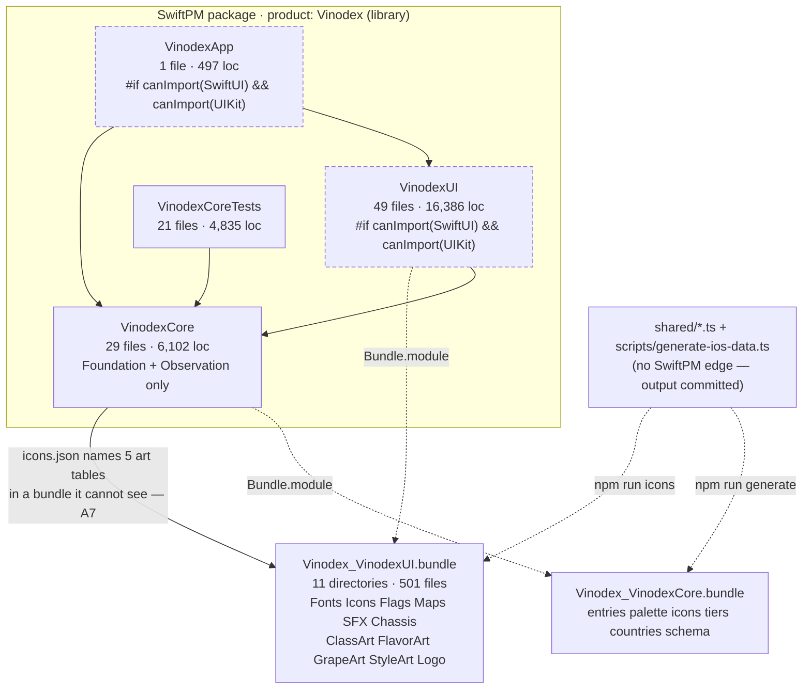
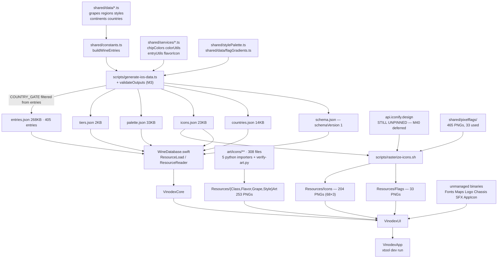

# Vinodex — Architecture, Repository & Platform Audit

**Authored by Godot.**

**Written 2026-07-28** · audited at `640efe9` (branch `audit`), with `upstream/main`
at `2cae512`. Four parallel audits: git history & hygiene, GitHub & remote topology,
Swift module architecture, build & data pipeline.

**Re-verified 2026-08-03 against the working tree at `da787a8` (branch `wip-local`).**
Every one of the 63 original findings was re-read against current source rather than
against its own line anchors. **18 are resolved, 11 partial, 31 open, 1 won't-fix, 3
not re-verifiable from a checkout.** One new blocking item — **X2** — was raised.

> **Read the working tree, not `HEAD`.** As with [auditS.md](auditS.md), this pass
> verified against the tree as it stands: **59 modified and 27 untracked files are
> uncommitted**, including every AUDIT.md fix from 2026-08-01 and 2026-08-03. That
> is **X2** below, and it is now the blocking item this document opens with.

> **Path note (0.6.5, batch 4).** `pixelflags/` throughout reads as
> **`shared/pixelflags/`** — the cross-repo master mirrored from `HGapps\shared`,
> consumed by both apps. The drawn-art masters that this document never saw now live
> in **`art/`** (created by AUDIT **H12**, 2026-07-31). This file moved from the repo
> root into `godot-md/`.

Companion to [AUDIT.md](AUDIT.md) — code-level defects, 107 items, IDs `H1`–`H12` /
`M1`–`M50` / `L1`–`L45` — and to [auditS.md](auditS.md), the compliance/security/test
audit, which **did not exist when this document was written** and now owns most of
the licensing and test-hygiene ground **R7** and **A20** stake out. Where a finding
here overlaps one there, the existing ID is cited rather than restated.

IDs here are stable and namespaced: **X** blocking · **R** repository/git ·
**P** platform/GitHub · **A** architecture · **B** build/pipeline. They are never
renumbered.

---

## Status

| Area | Resolved | Partial | Open | Won't-fix | Unverified | Total |
|---|---:|---:|---:|---:|---:|---:|
| Blocking | 1 | — | 1 | — | — | 2 |
| Repository & git | 6 | 1 | 5 | 1 | — | 13 |
| GitHub & platform | 3 | 1 | 3 | — | 3 | 10 |
| Module architecture | 6 | 6 | 12 | — | — | 24 |
| Build & pipeline | 2 | 3 | 10 | — | — | 15 |
| **Total** | **18** | **11** | **31** | **1** | **3** | **64** |

**What closed, and why it mostly was not this document's doing.** Fourteen of the
eighteen closures came from AUDIT.md work aimed at something else — **A1** by
auditS **C1**, **A12/A13** by **L9**, **A19/P2/B1** by the CI rewrite (**M34**),
**A20** by **M32**/**M46**, **A23** by **L25**, **R6** by **L20**, **R1** by **H6**,
**P5** by **M37**. The four that closed on their own terms are **X1**, **P1**,
**B6** and **B7**, and all four are consequences of the same decision: this repo
became authoritative on 2026-07-29.

**Two findings inverted rather than closed**, and their remedy lines are now wrong:

- **R1** said "stop shipping unused @2x/@3x scales." **H6** made `IconLoader` walk
  `@3x → @2x → @1x`, so all three scales are load-bearing. Deleting them would
  re-break the crispness fix. The recommendation is retracted.
- **B7** said "either build the country screen or delete `countries.ts`." The
  country screen was built; `countries.json` is a fifth generated output and
  `countries.ts` is genuinely consumed.

**Worse than when this audit ran.** The catalog went 284 → **405** entries and the
UI module went 21 files / 5,503 lines → **49 files / 16,386 lines**. Seven findings
grew with it: **A17** (24 → 57 `@AppStorage`), **A15** (21 → 49 flat files),
**A22** (5 → 12 unshared path literals), **A7** (2 → 11 asset directories behind an
uncheckable contract), **R2** (2.89 MiB → **42.32 MiB** pack), **B9** (4 → 6
non-atomic writes), **P7** (1 → 11 undeleted remote branches).

---

## X2 · A hundred findings' worth of work exists only in a dirty working tree — **Blocking**

This replaces **X1** as the item everything else is provisional behind, and it is
the same *class* of problem X1 was: work landed here does not durably exist.

`wip-local` is at `da787a8`, identical to `origin/main`, last committed
**2026-08-01 09:54**. Since then:

```
59 modified · 27 untracked · 0 staged · 0 commits ahead of origin/main
```

That tree contains every AUDIT.md fix from the 2026-08-01 Low-row batch and the two
2026-08-03 Medium batches — **M27 M29 M30 M32 M33 M35 M37 M45 M46 M47 M48 M49 M50**
plus L1–L45 — including nine new source files (`EntryPalette.swift`,
`SavedData.swift`, `SavedDataArchive.swift`, `DatabaseFixture.swift`, the four
`M30` splits) that are untracked. [auditS.md](auditS.md) records the same state and
names the consequence: `git stash` would reopen eleven of its findings.

The branch also has **no upstream tracking ref** (**P6**), so there is nothing to
push to by default, and CI — which is the only thing that has ever executed
`swift test` (see [the testing gap](#the-testing-gap-below-a1)) — has not seen any
of it.

→ Commit and push. This is the highest-value action available in the repository and
it costs one sitting. Nothing below is worth doing before it.

---

## X1 · The publish path is live, and it will overwrite the audit — **Resolved**

**Resolved 2026-07-29**, by the third and most expensive of the three options this
item offered: retire the publish entirely.

`scripts/publish-swift.mjs` is gone from the tree. The `swift` remote and the
`swift-main` branch are gone. `upstream` now points at `blaikooz/vinodex-ios` — the
repo was renamed from `vinodex-swift`, which is recorded in the CI cache key's
comment because the rename silently poisoned a `.build` cache and failed a green
branch on cache contents alone. `README.md:114-117` and
[KNOWN-ISSUES.md § Repo layout](../KNOWN-ISSUES.md) both state plainly that the
publish path has been deleted and that the monorepo's copies of `ios/`, `shared/`
and `pixelflags/` are frozen leftovers nobody edits. Nothing copies between the two
repos in either direction.

The item's own prediction came true in the interval: **this file's companion,
`AUDIT.md`, was deleted by a publish on 2026-07-29** and restored from `2cae512`.
That is what settled it.

Three `Published from blaikooz/vinodex@<sha>` trailers survive in history and are
now purely archaeological. The **88 open AUDIT items** this entry told you to treat
as "a written work order, not a fix queue" are down to **4**.

**The secondary consequence is also discharged.** `30af72b` (v0.4.1) touched the
files behind **H2, H6, H8, H9, H11, M5, M44**; all seven have since been
re-verified and closed against later commits.

---

## Findings at a glance

Highest-leverage items remaining, in the order they unblock each other:

1. **X2** — commit the tree. Everything else is provisional until then.
2. **A17** — one `AppSettings` type. The largest structural debt in the package and
   the only original "High" still fully open; it has more than doubled since.
3. **R7 / M36** — LICENSE and NOTICE. A public repo in breach of OFL and CC BY,
   with 68 attributed-license glyphs, 465 flags of unknown provenance, two OFL
   fonts, a 217 KB map and four SFX. Blocked on **two one-sentence answers from the
   owner**, not on engineering. See auditS **H1 H2 M1 M2 L1**.
4. **A2** — `PrivacyInfo.xcprivacy`. A hard App Store gate (ITMS-91053), still
   absent, still unlisted in AUDIT.md. See auditS **H3**.
5. **R3** — seven `.gitignore` patterns. The most likely route by which a
   credential enters this repo, unchanged in six days. See auditS **L11**.
6. **B5** — `"typecheck": "tsc --noEmit"`. The strict config still runs nowhere;
   three update logs claim it was run by hand, which is the failure mode this whole
   document is about.

---

## 1 · Repository & git history

### R1 · 909 KB of the pack is icon variants no code loads — **Resolved (inverted)**

**Resolved by AUDIT H6 (v0.6.3), the opposite way round.** `IconLoader.init`
resolves `preferredScale` from `UITraitCollection.current.displayScale` once, and
`load(slug:)` walks `@3x → @2x → @1x` loading via `UIImage(data:scale:)`. The hi-res
variants are load-bearing, not dead payload.

The tree also shrank on its own: `Resources/Icons` is **204 files (68 slugs × 3)**,
not 318 × 3 — **L17** pruned 21 orphans and the manifest's `unique` set fell from 99
to 68.

→ **This item's remedy is retracted.** `git rm`-ing the @2x/@3x sets would restore
the app-wide softness **H6** fixed. Any future pack-size work should read **L20**'s
lever list instead, which is measured and current.

### R2 · 813 PNGs, 87% binary pack, no asset policy — **Partial, and the footprint is 14× worse**

**The policy half landed** (**L20**, 2026-08-01): a four-rule binary-asset policy in
the README, `scripts/recompress-png.py` as the tool — it refuses to write a file
that does not round-trip — and orphan pruning in the rasterizer (**L17**).

**The footprint half went the other way, by an order of magnitude.** Measured now
against this item's own baseline:

| | Then (`640efe9`) | Now (`da787a8` + tree) |
|---|---:|---:|
| tracked PNGs | 813 | **1,262** |
| `size-pack` | 2.89 MiB | **42.32 MiB** |
| `shared/pixelflags/` | 465 | 465 (moved, unchanged) |
| `Resources/Icons` | 318 | 204 |
| `Resources/Flags` | 28 | 33 |
| `art/` | *did not exist* | **308 files, 35 MB** |
| other UI art (ClassArt/FlavorArt/GrapeArt/StyleArt/Chassis/SFX) | *did not exist* | 260 files |

`art/` is the whole story, and it is not waste: **H12** established that
`shared/newicons/` was the *only* surviving copy of every drawn source, so the
30 MB is the art masters and is not recoverable. **L20** records the three levers
that remain — `art/icons/reference/` (9 contact sheets, 11.7 MB),
`art/icons/attic/` (8 unreferenced icons, 849 KB), and ~8.4 MB of provably lossless
recompression across 298 masters — and correctly leaves all three as maintainer
calls.

→ **The skip-git-lfs verdict needs splitting.** It stays right for
`shared/pixelflags/` and `Resources/**` — individually tiny files where the
smudge-filter cost buys nothing. It is no longer obviously right for
`art/icons/reference/`: nine files averaging 1.3 MB, never diffed, never consumed by
a build step. That is the exact shape LFS exists for. Worth a decision rather than
an inherited default.

### R3 · No ignore rules for iOS signing material — **Open, unchanged**

`.gitignore` covers `.build/`, `.swiftpm/`, `DerivedData/`, `xcuserdata/`,
`*.xcuserstate`, `xtool/`, `node_modules/`, `scripts/.generate.mjs`,
`scripts/__pycache__/`, `.DS_Store`, `*.log` — and still **not**
`*.mobileprovision`, `*.p12`, `*.cer`, `*.certSigningRequest`, `*.ipa`, `*.dSYM/`
or `.env`. Re-verified line by line; nothing was added.

This repo deploys via xtool with a free Apple profile, so provisioning material is
handled in this working directory — and **X2** means `git add -A` is exactly the
command someone is about to run on a tree with 86 dirty paths.

→ Append the seven patterns. Duplicate of auditS **L11**, also open. Two minutes,
and it is the cheapest open item in either document.

### R4 · The commit `640efe9` is authored under a malformed email — **Open, unchanged**

```
author mirrorfarm <\342\200\234<redacted>@gmail.com\342\200\235> 1785289764 -0400
```

Still one commit of 77, still unattributable, still no `.mailmap`. The address is
wrapped in **U+201C/U+201D curly quotes** and also drops the dot the real address
carries. `git shortlog` now reports **four** identities:

```
62  blaikooz <68969906+blaikooz@users.noreply.github.com>
11  Claude <noreply@anthropic.com>
 3  mirrorfarm <mirror.servicesnyc@gmail.com>
 1  mirrorfarm <“mirrorservicesnyc@gmail.com”>
```

→ A `.mailmap` collapsing the malformed identity into the real one. The `Claude`
identity is correct as-is — it is the co-author trailer convention and should not be
mapped away.

### R5 · `640efe9 "audit1"` — empty subject and body — **Won't-fix**

Permanent in history, cannot be amended cleanly, and the practice it warned about
has corrected itself without intervention: **M37** measured the version-numbered
commits at **220–395 words each**, which is the richest prose in the repo. Closed as
documented history rather than open work.

### R6 · `AppIcon.png` is 929 KB, 33% of the pack — **Resolved**

**Resolved by L20 (2026-08-01).** 951,285 → **675,776 bytes (−29.0%)**, verified
pixel-and-mode identical against `HEAD` by `scripts/recompress-png.py`, which
refuses to write a file that does not round-trip.

This item's caveat still holds and is worth restating: **recompression does not
reclaim the git bytes.** The original blob stays in the pack forever absent a
history rewrite. AppIcon is now 1.5% of a 42.32 MiB pack rather than a third of a
2.89 MiB one, so the rewrite is even less justified than it was.

### R7 · Fonts, icons and flags are redistributed publicly with zero license text — **Open, and now the sharpest item in the repo**

Unchanged in substance and now the subject of five separate findings across two
other documents. Current state, re-verified:

- **2 OFL fonts**, no `OFL.txt` beside them. Their licences are **not** in question
  — **M36** read them out of the `name` tables (nameID 13/14): Press Start 2P, SIL
  OFL 1.1 with a Reserved Font Name; VT323, SIL OFL 1.1, no RFN. Both ship
  unmodified, so the RFN is satisfied. **This half needs no decision, only a file.**
- **68 icon glyphs**, not the 106 this item claimed: 55 game-icons (CC BY 3.0,
  attribution is a hard condition), 12 lucide (ISC), 1 mdi (Apache-2.0). No NOTICE.
- **465 `shared/pixelflags/`**, 33 shipped, no LICENSE, no README, filenames like
  `r_vexillology.png` indicating an unattributed community set (auditS **H2**).
- **1 map**, `updatedglobemap.jpg`, 217 KB, no recorded source (auditS **L1**).
- **4 SFX**, and this is the one that blocks `NOTICE`: `DexSound.swift` calls them
  "the authored SFX pack," which does not distinguish "we made them" from "we
  licensed a pack." **M36** asked; the answer was deferred. A NOTICE written today
  would assert first-party ownership of four files nobody has confirmed.
- **No top-level LICENSE**, so GitHub reports `licenseInfo: null` — all rights
  reserved by default, on a public repo, while redistributing all of the above.

**M36** is `[~]` and deliberately held: the LICENSE is an ownership decision
(all-rights-reserved, MIT, or a split keeping the drawn art proprietary), not a
technical one. That is the right call and this document does not second-guess it.

→ The addition this item makes, and it still stands: **the distribution breach is
independent of what the app displays.** OFL §2 and CC BY 3.0 §4(c) are being
breached at the repository level right now, and have been for six days longer than
when this was written. Two one-sentence answers from the owner unblock all of it.

### R8 · Commit scope changed `(native)` → `(ios)` silently — **Resolved in practice**

`(ios)` won. Every commit since 2026-07-30 uses it (`feat(ios)`, `fix(ios)`,
`data(ios)`, `chore(assets)`, `docs(audit)`); the 22 `(native)` commits are all
older than that. The boundary is real but it is now historical, and it matches the
monorepo's `ios/` prefix as this item recommended.

Residual: it is still undocumented. One line in the README's contributing section
would close it properly. Low.

### R9 · History is machine-replayed, not authored — **Resolved**

Discharged by **X1**. 77 commits now, of which **3** carry a `Published from`
trailer. `git bisect` and `git blame` point at the change that caused a regression,
because the change was made here. The trailer is no longer a bridge to anywhere —
it is a footnote on three old commits.

### R10 · Commit granularity is coarse — **Open, and the predicted cost was paid**

Still true, and this document can now name what it cost rather than predicting it.
**M37** found that `869c3b7` carried **four releases** — 0.5.8, 0.5.9, 0.6.0 and
0.6.1 — in one commit, so **there is no tree to check out for any of them and they
cannot be tagged**. Four version numbers have CHANGELOG entries and a recorded
reason for having no tag. That is exactly "nothing is revertable at a useful
granularity," realised.

No longer a property of publish batching — the batching is now a habit. **X2** is
the same habit at a larger scale.

### R11 · `*.sh` lacks `eol=lf` — **Resolved**

`.gitattributes:36` — `*.sh text eol=lf`, with a comment naming the failure it
prevents (`set -euo pipefail` under a CRLF checkout in WSL).

### R12 · 100 `pixelflags/` paths contain spaces — **Open, now 109**

`shared/pixelflags/North America/…` and 108 siblings. The tree moved but the naming
did not. **L25** closed half the risk this item named — the country→slug rule is now
generated once (`flagSlugs`) and read by both consumers, so divergence can no longer
silently drop a flag — but the unquoted-glob surface in the shell is auditS **L10**,
which is still open.

→ Rename to `north_america/` to match the lowercase-underscore convention the leaf
directories already use, or close auditS **L10** and leave the names alone. Pick one.

### R13 · `package-lock.json` neither tracked nor ignored — **Resolved**

Tracked. `npm ci` is now possible — see **B3** for why it is still not *used*.

### Confirmed clean — re-verified 2026-08-03

Secrets: **zero hits** across all 77 commits on all refs for AWS keys, GitHub
tokens, OpenAI keys, Slack tokens and private-key headers. No `.env`,
`.mobileprovision`, `.p12`, `.cer`, `.pem` or keystore has ever been added in any
commit — re-run with `--diff-filter=A` over the full history, not just the 28
commits the original pass saw. `.gitattributes` still classifies every tracked
binary correctly. Working tree has no stashes, no submodules, no custom hooks.

The 4.5 MB copyrighted Sotheby's text remains **absent from this mirror**; the
mirroring boundary held and the exposure is upstream only (auditS **M4**).

Two claims from the original pass are **no longer re-verifiable and should not be
relied on**: the "64/64 tracked text files are LF" census (the tree has grown well
past that) and the delta-compression measurement on `entries.json` (five historical
versions became many more, and the pack is now 14× larger).

---

## 2 · GitHub & platform

### P1 · README declares the repo disposable while PRs merge into it — **Resolved**

`README.md:114-117` now states it once, unambiguously, in the past tense: the repo
was assembled by a publish script that emptied the tree, that path has been deleted,
and the monorepo's copies are frozen. The contradiction this item named — two
opposite answers to *do my commits survive?* on one screen — is gone.

Residual staleness worth a separate line, not a reopening: `README.md:149-152` still
says UI changes "have to be checked on a device," which predates the `ios` and
`ios-test` CI jobs. It is now the *second*-best check, not the only one.

### P2 · No CI in either repo, and it must run on Linux — **Resolved, and exceeded**

`.github/workflows/ci.yml` exists and is substantially better than the workflow this
document proposed. Four jobs:

| Job | Runner | What it gates |
|---|---|---|
| `test` | `swift:6.0` (Linux) | `swift test --enable-code-coverage`, plus a grep holding **H11**'s type floor |
| `ios` | `macos-15` | `xcodebuild -destination 'generic/platform=iOS'` — the only Xcode-grade type check this project has |
| `ios-test` | `macos-15` | `xcodebuild test` on an iPhone 16 simulator |
| `data` | `ubuntu-latest` | `npm run generate` then `git diff --exit-code` (= **M41**) |

Four things it got right that this document did not propose:

- **`on: push: branches: ['**']`**, not `[main]`. Work happens on `audit` and on
  eleven `vN.N-batch` branches; scoping to `main` meant the batch that broke the
  macOS build was checked by nothing.
- **The cache key includes `github.repository`.** The `vinodex-swift` →
  `vinodex-ios` rename kept matching an old key, the restored PCH pointed at a
  workspace path that no longer existed, and every file failed with an error naming
  neither the cache nor the rename. Keying on the name means the next rename misses
  instead of poisoning.
- **`ios-test` exists at all.** This document proposed only a compile. The workflow
  comment states its real purpose — somewhere for a `VinodexUITests` target to run
  — which is the unblock for **A21** and for **M49**'s outstanding device pass.
- **A `Note what this does not cover` step** that emits a GitHub notice saying the
  Linux job cannot fail on a UI type error. The caveat is in the run output, not
  only in a comment.

This document's prediction that the `xcodebuild`-on-a-bare-SwiftPM-package job would
need "a couple of pushes rather than getting it right first try" was correct and the
iteration happened.

**Residual, and it is the whole of B5:** nothing runs `tsc --noEmit`.

### P3 · Fork `main` is 4 commits behind upstream, 0 ahead — **Resolved (inverted)**

The topology reversed with **X1**. Measured now:

```
origin/main ... HEAD          → 0 behind, 0 ahead
upstream/main ... origin/main → 0 behind, 13 ahead
```

This repo is authoritative and thirteen commits ahead of the repo it was forked
from. `gh repo sync --source` would now be actively wrong — it would rewind. The
routine this item asked for should be deleted from anyone's habits, not adopted.

### P4 · No branch protection or ruleset in either repo — **Not re-verified**

Requires `gh api`, which this pass did not run. The advice stands on its own terms
and is now actionable in a way it was not: **P2** is resolved, and this item's
condition was "once CI exists, one ruleset on `main` requiring the `core` status
check, no review requirement, owner bypass allowed." The check to require is
`test` — not `ios` or `ios-test`, which depend on paid-tier-adjacent macOS minutes
and will occasionally flake on simulator availability.

### P5 · No tags, releases, CHANGELOG, or bundle version — **Partial (two-thirds resolved)**

**Resolved by M37 (2026-08-03):**

- **28 annotated tags**, up from 0 — 22 of them backfilled, each carrying
  `GIT_COMMITTER_DATE` set to its own commit's date so `--sort=taggerdate` reports
  release order rather than backfill order, and each annotation saying it was
  backfilled. **Created locally and not pushed** — which folds into **X2**.
- **[CHANGELOG.md](../CHANGELOG.md)** exists, Keep a Changelog 1.1, newest first,
  0.6.5 back to 0.2.1.
- This document's "skip GitHub Releases" advice was taken and remains right.

**Still blocked, genuinely:** the bundle version. xtool 1.17 hardcodes
`CFBundleShortVersionString = 1.0.0` with no key to override it, which is why
`AppVersion` has to *reject* the bundled value. Reopens when there is a signing
pipeline. This is also **A2**'s problem from the other side — there is no Info.plist
source for it to land in.

The re-dating of **M38** in this item is discharged: the hardcoded `"v0.3.5"` is
gone, the back plate reads `AppVersion.display`, and `AppVersionTests` pins the
placeholder denylist that a regression at `0a446d3` needed.

### P6 · `audit` has no upstream tracking ref — **Open, and now two branches**

```
audit     -> (none)
main      -> origin/main
wip-local -> (none)
```

`wip-local` is where all the work is (**X2**) and it has nothing to push to by
default. That upgrades this from a cosmetic nit to a contributing cause.

```bash
git branch --set-upstream-to=origin/main wip-local
```

### P7 · Merged branches are not auto-deleted — **Open, worse**

One stale branch then; **eleven** `upstream/` refs now — `testing`, `v0.5.0-batch`,
`v0.5.1-batch`, `v0.5.3-batch`, `v0.5.4-batch`, `v0.5.6-batch`, `v0.5.7-batch`,
`v0.6-batch`, `v0.6.3-batch` and two more — plus `origin/audit` still at `640efe9`.
This document predicted "fifteen after the AUDIT workstreams" and the count is
tracking that.

→ Enable "Automatically delete head branches" on both repos.

### P8 · Both repos have an empty Wiki enabled — **Not re-verified**

Requires `gh api`. The argument is unchanged and slightly stronger: in-tree
documentation is now four files (`README.md`, `KNOWN-ISSUES.md`, `CHANGELOG.md`,
plus `godot-md/`), and a wiki tab is a fifth place for them to fork.

### P9 · Placeholder description, no topics — **Not re-verified**

Requires `gh api`. Note the repo was renamed to `vinodex-ios`, so any description
written now should not repeat the old name.

### P10 · `upstream` has a live push URL without push rights — **Open**

Unchanged in shape, and the URL changed with the rename:

```
upstream  https://github.com/blaikooz/vinodex-ios.git (push)
```

Still the mildest item in the report.

### Contribution infrastructure — re-checked

`.github/` now contains exactly one file — `workflows/ci.yml` — which is what this
document recommended. The skip list held up: no `CONTRIBUTING.md`, no `CODEOWNERS`,
no `SECURITY.md`, no issue templates, and none of them has been missed.

Two changes to the original advice:

- **The PR-template recommendation is void.** It was conditional on X1 resolving
  toward "publish stays live." It resolved the other way.
- **LICENSE + NOTICE remain the one genuine gap**, and it is now **R7** plus five
  auditS findings rather than a bullet here.

### Confirmed clean

Not re-verified this pass (needs `gh api`): secret scanning and push protection on
the fork, Actions default permissions, Dependabot state. The dependency surface is
re-confirmed from the tree and is still near-zero: no `Package.resolved`, no
`.package(` in `Package.swift`, three build-time npm devDependencies that never
reach a device. The real supply-chain exposure is still **M40** (unpinned
`api.iconify.design` fetch), now **deferred at the maintainer's direction** with a
complete plan and a checkable fingerprint recorded in the item.

---

## 3 · Module & package architecture



Dashed = invisible to `swift test`. **Since 2026-07-29, no longer invisible to CI** —
see **A9**.

### The testing gap, below A1

Worth stating once because five findings below depend on it. Neither maintainer can
install Xcode, `swift test` cannot run on either machine (`no such module 'Testing'`),
and xtool has no `test` subcommand and no simulator support. Three mechanisms cover
the gap today, in descending order of authority:

1. **CI's `test` / `ios` / `ios-test` jobs** — the only thing that has ever executed
   a test or type-checked the UI layer. Blocked by **X2** on the current work.
2. **`scripts/typecheck-ios-surface.sh`** — a local shim harness that type-checks
   `VinodexUI` against a baseline. It caught both **M30** access errors, one **M35**
   UI error, and a `FlagSwatch` scope error in **M27**. It is the only local check
   that sees the module at all.
3. **`scripts/typecheck-core-tests.py`** — type-checks all 21 test files with the
   swift-testing macros stripped. First thing to ever check the test target locally.

None of the three is `swift test`. Every AUDIT update log since 2026-08-01 says so
explicitly, which is the right way to report it.

### A1 · The package does not build on a platform it declares — **Resolved**

**Resolved**, and it is auditS **C1** — the one confirmed critical finding in either
document. `Sources/VinodexApp/VinodexApp.swift:1` now reads
`#if canImport(SwiftUI) && canImport(UIKit)`, matching all 47 guarded VinodexUI
files. The two-character fix this item asked for.

The failure class is now pinned permanently by CI's `ios` job. Measured on
2026-07-31 with Swift 6.2.3: an undefined symbol injected inside
`#if canImport(UIKit)` in `Haptics.swift` produced "Build complete!" from
`swift build` on macOS and was invisible to `swift test` on Linux. Only an iOS
compile sees it. That measurement is in the workflow's own comments, which is where
it belongs.

### A9 · 78% of the source is invisible to the only automated gate — **Partial**

**The ratio did not improve; the consequence closed.** Re-measured:

| Module | Files | Lines | Compiled by `swift test` | Compiled by CI |
|---|---:|---:|---|---|
| VinodexCore | 8 → **29** | 1,593 → **6,102** | yes | yes |
| VinodexUI | 21 → **49** | 5,503 → **16,386** | **no** | **yes** (`ios`, `ios-test`) |
| VinodexApp | 1 → **1** | 235 → **497** | **no** | **yes** |
| **Total** | **30 → 79** | **7,331 → 22,985** | **21.7% → 26.5%** | **100%** |

`swift test` still sees only a quarter of the source, and the uncompiled remainder
grew from 5,738 lines to **16,883**. What changed is that "uncompiled" no longer
means "unchecked": the `ios` job is a full Xcode-grade type check of all of it on
every push to every branch.

This item's warning about **M28**, **M30** and **L9** — "mechanical multi-file
refactors of the *uncompiled* 78%, with zero compiler feedback available" — was
correct and all three have since landed, with `typecheck-ios-surface.sh` rather than
a compiler catching the errors they introduced. That is the tool this item asked for
in a different form: it proposed the Darwin SDK cross-compile, and what shipped is a
shim harness plus CI. **The Darwin-SDK path is still worth having** — it would give
seconds-long full-package feedback on the dev host instead of a push-and-wait — but
it is now an ergonomics item, not a correctness one.

### A17 · There is no state architecture — there are four uncoordinated mechanisms — **Open, and it more than doubled**

The largest structural debt in the package, and one of two original **High** items
still fully open — the other is **R3**, which is seven lines of `.gitignore`.
Re-measured against this item's own four mechanisms:

1. **Navigation** — `@State private var path: [DexRoute]` rendered as `path.last`.
   **M26** closed the user-visible half via route-keyed stores (`SearchStateStore`,
   `ScreenStateStore`); the rendering shape is unchanged and deliberately so.
2. **Global singletons read directly by UI files** — **M27** closed this. 23
   executable `WineDatabase.shared` reads → **2**, via a defaulted
   `db: WineDatabase = .shared` init parameter, with `EntryVisualCache` and
   `FlagLoader` re-keyed rather than parameterised. **VinodexCore holds zero.**
3. **`@AppStorage` sprawl — much worse.** 24 declarations over 6 keys → **57 over
   8**, and `lcdMode` alone is re-declared **35 times** (was 16):

   ```
   35  @AppStorage(LcdMode.storageKey)
    7  @AppStorage(ChassisSkin.storageKey)
    3  @AppStorage(TextScale.storageKey)
    2  @AppStorage(UIScale.storageKey)
    1  each: UserProfile.displayNameKey, Sounds, ScreenWake, Haptics
   ```

4. **Static unobservable reads — formalised rather than fixed.** **L16** built
   `SettingsCache` (Core, lock-guarded, invalidated wholesale by
   `UserDefaults.didChangeNotification`) serving `TextScale.current`,
   `UIScale.current`, `LcdMode.current`, `Sounds.enabled` and `Haptics.enabled`.
   That was the right fix for the *cost* — `TextScale.current` was a defaults read
   per `Font`, per glyph run, per render — and it makes the reads fast, cached and
   still unobservable by SwiftUI. **H3**'s `.id(scaleRaw)` remount is still the
   mechanism by which a text-size change takes effect.

Two of four mechanisms closed, one got 2.4× worse, one got faster without changing
shape. The diagnosis is unchanged and now better evidenced: **settings are stored,
not modelled.**

→ One `@Observable final class AppSettings` in Core owning the eight keys, injected
once via `.environment(settings)`, with a UI-side extension supplying the
`Color`/`CGFloat` mappings. `SettingsCache` becomes its storage layer rather than a
parallel mechanism. That retires **M13**, retires **H3**'s residual `.id` hack, and
removes 57 scattered declarations.

**One caveat M27 discovered the hard way, and it applies directly here.** The
environment is the wrong injection point for anything read in `init`:
`ChipFilterScreen`, `CountryScreen` and `RootView` read the database in `init` *on
purpose* (moving it to `onAppear` reopens the first-frame "0 MATCHES" flash **M5**
closed), and `.id(…)`-keyed screens re-run `init` on every TEXT SIZE change —
exactly when an environment value is invisible. `AppSettings` should follow **M27**'s
precedent: a defaulted init parameter, not an `EnvironmentKey`.

### A19 · Nothing verifies that the app compiles — **Resolved**

Discharged by **P2**. Three mechanisms now do, listed under
[the testing gap](#the-testing-gap-below-a1). The precondition this item named for
**M28**, **M30** and **L9** was met and all three landed.

### A2 · No app metadata exists anywhere, including no privacy manifest — **Open**

**Structurally unchanged, and M17 proved the structural point.** `xtool.yml` is
still `bundleID` + `iconPath` — now with 20 lines of comment explaining why an
orientation key cannot go there. **M17** needed a portrait lock, found that
`xtool.yml` is not a passthrough for the generated Info.plist, and put the lock in
`AppDelegate.application(_:supportedInterfaceOrientationsFor:)` instead. That is the
stronger mechanism and the right call — but it is a workaround for the gap this item
names, not a closure of it.

**Still absent from the entire tree:** `PrivacyInfo.xcprivacy`. The app uses
`UserDefaults` — a Required Reason API — at **20 keys** (**M35** enumerated them via
`SavedDataKey.allCases`; the old figure of 6 was wrong, and so was the interim 17).
That is a guaranteed ITMS-91053 rejection.

This is auditS **H3**, and **M6** there covers the missing Info.plist source
(export-compliance key, display name, version). Neither is in AUDIT.md. It remains
the case that **no AUDIT.md item owns the privacy manifest**, which is why this
entry exists.

### A6 · The settings model is stranded in the untestable module — **Partial (one of three)**

**`TextScale` moved to Core.** **H11** relocated it to
`Sources/VinodexCore/TypeScale.swift` along with the size resolver, precisely so the
arithmetic is reachable from `swift test` at all — and `TypeScaleTests` now pins
1,540 assertions across four text steps, plus **M49**'s `monoRunWidth` /
`retroRunWidth` derivations read out of the shipped `.ttf` `hmtx` tables. A
`DexTheme.swift` comment records the move.

**`LcdMode` and `ChassisSkin` did not move.** They live in
`Sources/VinodexUI/ScreenModes.swift` and `ChassisSkins.swift` (both split out of
`DexTheme.swift` by **M30**), still owning persistence keys, defaults and
fallback-on-garbage behaviour, still in the module purely because each also exposes
SwiftUI `Color` properties.

The `extension LcdMode { var screen: Color … }` split this item proposed is exactly
what H11 did for `TextScale`, and it worked. The remaining two are the same edit
twice, and both are prerequisites for **A17**.

### A7 · `IconManifest` lives in Core; the assets it indexes ship in UI's bundle — **Open, and the surface grew 5×**

Unchanged in structure and much larger in exposure. `icons.json` is decoded from
Core's bundle; it now indexes **five art tables plus flags** whose PNGs are all in
UI's bundle:

```
unique 68 · flavorArt 106 · grapeArt 27 · styleArt 30 · countryShapeIcons 28 · flags 33
```

Asset directories in `Resources/`: 2 at audit time (`Icons`, `Flags`), **11** now.
Two targets, two resource bundles, one implicit contract that no build step, test,
or type checks.

**Mitigated at runtime, not at build time.** **L26** built `DexAssetAudit`, which
resolves every id the manifest names through the bundle and reports per surface in
SETTINGS ▸ DEV — icons at **all three scales**, since a set missing only its `@3x`
would otherwise draw softly forever. Current state, verified: 68/68 icons, 94/94
`art:`, 96/96 flavorArt, 14/14 grapeArt, 30/30 styleArt, 33/33 flags. Nothing is
missing.

That is a diagnostic, not a gate, and it lives in the module `swift test` cannot
see — which is **A21**.

→ This item's fix (move `icons.json` into `Sources/VinodexUI/Resources/`) is now
**more expensive than when it was written**: `WineDatabase` decodes the manifest and
five Core call sites read it. The cheaper version of the same guarantee is a test in
the **`ios-test`** job, which did not exist then and does now.

### A12 · VinodexUI has no intended API — it has 41 accidentally-public types — **Resolved**

**Resolved by L9 (2026-08-01).** 41 public types → **30**, which is exactly what
`VinodexApp` names. 195 `public` keywords removed across 18 files; `PixelArtLoader`
and `FlagLoader` were made to match `GrapeSpriteLoader`, which this document
identified as the pattern to copy. One knock-on the compiler caught:
`WineDatabase.dataState` could not stay a public extension over an internal
`DexDataState`.

The `// MARK: - Public surface` block was not added and is no longer needed — the
count *is* the statement now, because it was derived from the app's own references
rather than left to accumulate.

### A15 · `Sources/VinodexUI/` is 21 flat files with no directory structure — **Open, worse: 49 files**

Still one namespace-less list; `Resources/` is still the only subdirectory. **M30**
added nine files to it (`ChassisButton`, `ChassisEffects`, `MarqueeBanner`,
`EntryDetailSections`, `EntryDetailRows`, `ScreenModes`, `ChassisSkins`,
`SettingsControls`, `SavedDataActions`) and the eight screens added since the audit
went in flat too.

The five-directory proposal is more obviously right at 49 files than at 21, and the
groupings now write themselves — `ChassisButton` / `ChassisEffects` /
`ChassisSkins` / `DeviceChassis` / `DeviceBackPlate` / `MarqueeBanner` is a
`Chassis/` directory that already exists in everything but the filesystem.

→ `Screens/` · `Components/` · `Chassis/` · `Theme/` · `Platform/`. Directory moves
are free in SwiftPM. Do it in the same sitting as **A17**, since that refactor
touches most of the module anyway.

### A18 · Persistence has no namespace, no version, no migration hook — **Partial, and half of it is unimplementable**

**The namespace landed.** **M35** built `SavedDataKey`
(`Sources/VinodexCore/SavedData.swift`) — a `String`-raw-value `CaseIterable` enum
owning all **20** literals, with every declaring constant derived from it so the two
spellings cannot drift. `SavedDataReset.wipeAll()` iterates `allCases`; the
hand-kept 17-element array that had silently drifted from the stores is gone.

**The migration hook is not going to be written, and should be retired rather than
left open.** **M35** established why: on iOS the bundle ID *is* the container
identity. A new App ID gets a new `Library/Preferences/<bundleID>.plist` and a new
`Library/Application Support/`, and the old container is not readable, not
enumerable, and is deleted with the old app. There is no in-place migration, and
code claiming to be one would be a lie. What shipped instead is an export the user
carries across — `SavedDataArchive` plus BACK UP / RESTORE in SETTINGS ▸ STORED
DATA, which is also a backup and a way to move a shelf between phones.

**One trap M35 records that anyone touching this must know:** six `@Observable`
stores read `UserDefaults` **once, in `init`**, and hold the values for the life of
the process. Writing keys is only half a restore — each store gained `reload()`, and
`reloadPicksUpAnImport` demonstrates the stale read rather than describing it.

**Still genuinely missing:** a `schemaVersion` on the defaults suite. `schema.json`
versions the *bundled data* (**M3**/**M45**); nothing versions the *stored* data. A
future key whose meaning changes has nowhere to declare it.

### A20 · Logic tests are bound to the shipped dataset — **Resolved**

**Resolved by M32 and M46.** Two seams landed:

- **`DBFixture`** (`Tests/VinodexCoreTests/DatabaseFixture.swift`) — the fixture
  database this item asked for. It takes **JSON, not Swift literals, and there is no
  choice about it**: all five `WineEntry` variants declare `init(from:)` in the type
  body, which suppresses the synthesised memberwise initialiser, so a `WineEntry`
  cannot be constructed by hand at all. Going through
  `WineDatabase.decodeEntries(from:)` is the app's real load path, so a fixture that
  stops decoding is one that has drifted from the schema.
- **`WineDatabase(reading:)` + `ResourceReader.fixture`** — makes every **M45**/
  **M46** loader branch reachable. None of them was, which is why both items
  survived four re-verification passes.

`FilterTests`, `DailyPickTests` and the new `StyleInferenceTests` now reach cases
the shipped catalogue can never produce — an empty database, a database with an
empty category, a single surviving category carrying every day of the rotation.
`CoverageTests`/`ContinentTests` still open on `WineDatabase.shared`, which is the
point for them.

The `WineDatabase.init(entries:palette:icons:freeIDs:decodeErrors:)` this item
identified as "public and no test calls it" is now reached through the reader seam.

**Note a stale disagreement:** auditS **L13** still lists this as open. It is not;
`DatabaseFixture.swift` is one of the 27 untracked files in **X2**, which is
probably why.

### A21 · Resource loading is structurally untestable — **Partial**

**Runtime coverage landed; testability did not.** `DexAssetAudit` (**L26**) probes
all five asset surfaces through `DexResources.url` and reports per surface — the
count-only rows are gone. But it lives in `Sources/VinodexUI/`, behind the guard, so
`swift test` still cannot execute a single assertion about `DexResources`,
`IconLoader`, `FlagImage`, or font registration.

This item's proposed workaround — a Core-side test asserting manifest→bundle
coverage — is still blocked by **A7** for the same reason it was: the PNGs are in
the other target's bundle.

**What changed is that there is now somewhere for the real test to go.** CI's
`ios-test` job runs `xcodebuild test` on a simulator, and its own comment states the
purpose: give a `VinodexUITests` target somewhere to run, guarded exactly as the 49
files in `Sources/VinodexUI/` already are, compiling to an empty module on Linux.
That target does not exist yet. Creating it is the fix for this item, for **A21**'s
half of **A7**, and for **M49**'s outstanding device pass.

### A22 · Every asset lookup is an unverified string path — **Open, worse: 5 sites → 12**

Re-counted across the tree:

```
Resources/Icons    DexIcon.swift:66, DexAssetAudit.swift:132
Resources/Chassis  DeviceChassis.swift:709
Resources/Logo     DeviceChassis.swift:721
Resources/Fonts    DexTheme.swift:401
Resources/SFX      DexSound.swift:118
Resources/Flags    EntryVisual.swift:316
Resources/Maps     RetroGlobeScreen.swift:572
(variable subdir)  EntryVisual.swift:281, DexAssetAudit.swift:138
```

Eight files, no shared constant, and the failure mode this item named still holds:
a typo or directory rename compiles, tests green, and ships as a red questionmark
glyph, a grey block, a system monospace font, a silent tap, or a flat green sphere.
**Most of these are visually plausible enough to survive a device check.**

`DexAssetAudit` catches a *missing file* at runtime. It does not catch a *wrong
literal* — it uses the same literals.

→ A `DexAsset` enum owning the paths, consumed by both the loaders and the audit, so
a rename is one edit. Cheap, mechanical, and now protected by the `ios` job.

### A10 · The guard is drawn at the module, but the module is not all UI — **Open, narrowed**

Two of the three examples this item named have moved out from behind the guard:
**A6**/**H11** took `TextScale`, and **M29** took `Palette.resolve`,
`styleToneKey(for:)` and `grapeWellFallbackHex(style:body:)` into
`Sources/VinodexCore/EntryPalette.swift` — a file move rather than a refactor, since
all three were already pure over Core-only types.

The structural point is unchanged and the number behind it is 3× larger: **16,386
lines** sit behind `#if canImport(SwiftUI) && canImport(UIKit)`, and the manifest
slug consumption, `LcdMode`, `ChassisSkin` and `DexAssetAudit`'s probe logic are all
still among them. The fix is still to shrink what sits behind the guard, not to move
the guard.

### A11 · Three different guard spellings across the tree — **Open, unchanged in kind**

Re-counted across `Sources/VinodexUI/`:

```
47  #if canImport(SwiftUI) && canImport(UIKit)
 1  #if canImport(UIKit) && canImport(AVFoundation)   — DexSound.swift
 1  #if canImport(UIKit)                              — Haptics.swift
```

`Haptics.swift:1` still carries **A1**'s exact failure shape one module down. The
`AVFoundation` variant is new and is *correct* — `DexSound` genuinely needs both —
so the count is three spellings for two reasons, which is one more than necessary.

Harmless today. It was harmless in `VinodexApp.swift` too, until it was not.

### A13 · Core's public surface has two outliers — **Resolved, with a correction**

**Resolved by L9.** `DexResources` is now `enum DexResources` — internal.

**Correction to this item:** `DexResources` was never in `VinodexCore`. It lives in
`Sources/VinodexUI/DexTheme.swift:485` and always did, so this item mislocated it.
`EntryTiers` no longer appears in the tree under that name.

### A14 · A fallback lookup that can never fire — **Open, unchanged**

`Sources/VinodexUI/DexTheme.swift:486-493`:

```swift
static func url(named name: String, ext: String, subdirectory: String? = nil) -> URL? {
    if let subdirectory,
       let hit = Bundle.module.url(forResource: name, withExtension: ext, subdirectory: subdirectory) {
        return hit
    }
    return Bundle.module.url(forResource: name, withExtension: ext)
}
```

Under `.copy("Resources")` the directory structure is preserved verbatim, so the
subdirectory-less lookup on the last line cannot succeed for any of the 12 call
sites in **A22**. A miss reads as "handled" and returns `nil` one line later anyway.

Now slightly more than cosmetic: `DexAssetAudit` (**L26**) resolves every manifest id
through this exact function, so the dead branch sits inside the project's only asset
guard rail.

→ Delete the fallback, or make the miss loud. It is four lines.

### A16 · File names understate contents — **Partial**

**Substantially improved by M30 (2026-08-03)**, which split four files rather than
the two it named, taking this document's and its own corrections seriously:

| File | Was | Now |
|---|---:|---:|
| `DexTheme.swift` | 1,661 | **499** |
| `DeviceChassis.swift` | 1,220 | **735** |
| `EntryDetailScreen.swift` | 1,079 | **574** |
| `SettingsPanel.swift` | 1,617 | **1,250** |

All pure code motion. The move immediately earned its keep: two `private` members
meant "this file," which is exactly the coupling being removed, and both were caught
by `typecheck-ios-surface.sh`.

**Still true:** `SettingsPanel.swift` is 1,250 lines and remains the largest file in
the module; `ScannerScreen.swift` is **1,078** and has never been audited by anything
— it postdates every pass in all three documents.

### A3 · `.copy("Resources")` is right but unexplained — **Open, Low**

`Package.swift` gained a good comment block about the `#if` guards and the
single-product constraint, and still says nothing about `.copy`. The reasoning is
worth one sentence: `.process` would flatten the directory structure that all 12
call sites in **A22** depend on. The cost — it ships the directory verbatim — is now
smaller than it was, since **L17** added orphan pruning.

### A4 · Toolchain versions disagree, in three places now — **Open, Low**

- `Package.swift:1` — `// swift-tools-version: 6.0`
- `README.md:14,100` — `Swift 6.3`
- `.github/workflows/ci.yml` — `container: swift:6.0`

Still no `swiftSettings`, no `.swift-version`. Two-way disagreement became
three-way. Pairs with **L22**, which pinned xtool at 1.17.0 and left Swift alone.

### A5 · Core and UI are not products — **Open, Low**

Unchanged. `VinodexCore` — now 29 files and 6,102 lines of deliberately portable,
Linux-testable code with 21 test files against it — still cannot be consumed by a
future macOS target, CLI validator, or snapshot harness. Adding a second `.library`
costs nothing and does not disturb xtool's one-product expectation, since xtool
resolves the product it is told to build.

### A8 · `WineEntry.destination` puts navigation policy on the model — **Open, note**

Unchanged and now tested rather than merely commented: **M47**'s
`RouteAndSearchStateTests` covers the `.detail` fall-through, `scanTitle` and
`scanSymbol`, and `ContinentTests` already covered the `.continent` early return.
`DexRoute` in Core is still right; the extension is still the debatable part. Small,
well-commented, well-tested — a note, not work.

### A23 · Three independent slug rules over one contract — **Resolved**

**Resolved by L25 (2026-08-01)** for the flag half, exactly as proposed here: the
generator emits `flagSlugs` (33 entries) and both consumers read it —
`rasterize-icons.sh` names the copied PNG from it and fails loudly on a missing
entry rather than falling back, and `IconManifest.flagSlug(for:)` returns it. The
generator's rule folds diacritics and collapses every non-alphanumeric run, and was
verified byte-identical to both old rules on all 33 current keys, so no flag was
renamed. Asserted non-empty in `ICONS_REQUIRED_NONEMPTY`.

The icon half (`:` → `--`) is now single-sourced too: `unique` is a generated field
and `DexAssetAudit` walks it.

### A24 · The generated-data edge is invisible to SwiftPM — **Partial**

Structurally unchanged — a target's source tree still contains build artifacts of a
second toolchain with no expressible SwiftPM dependency, and that is inherent to the
design rather than a defect to fix.

**Both symptoms it named are now gated.** **M41** — CI's `data` job regenerates from
`shared/` and fails on any diff against `Sources/VinodexCore/Resources`. **M3** — the
schema contract this document asked for exists on both sides: `SCHEMA_VERSION`
emitted into `schema.json`, `expectedSchemaVersion` asserted at load with
cross-references in comments so they get bumped together, and `validateOutputs`
checking **every non-optional property of every Swift struct it can reach**, per
category, from declared contract tables. Proven by eight injected drifts, each of
which fails `npm run generate` and names the offending entry by id.

**M45** closed the follow-on that fix opened: a *missing* stamp is a `loadNotice`
(maintainer-facing), a *wrong* or unreadable one is a `decodeError` (user-facing),
and `#expect(loadNotices.isEmpty)` in two suites means deleting `schema.json` turns
CI red instead of every launch.

### What's working — re-verified

Everything this section claimed still holds, and three items strengthened:

- **Dependency direction.** App → UI → Core, acyclic, verified across all 79 files.
  Core imports only `Foundation` and `Observation` at 6,102 lines — the
  Foundation-only promise held through a 4× expansion, which is the real test of it.
- **`DexRoute` as a typed enum with associated values.** Still the best-designed
  seam in the package, and **M47** now walks all **28** constructible routes
  asserting both `title` and `marqueeSymbol` are non-empty — because an exhaustive
  switch cannot compile without an answer, but an *empty* answer compiles fine and
  renders as a blank marquee.
- **Pure display logic lives in Core and is tested.** **M29** did what this section
  predicted it would: moved `Palette.resolve` and the two keyword heuristics into
  `EntryPalette.swift` as a file move, not a refactor, because they were already
  pure. **The coverage bought more than the item asked for** — a twelve-branch
  ladder over twenty-four literal spellings is hand-written while `styleTones` is
  *generated*, and nothing could notice them parting company. Two tests do now.
- **Injection seams exist where it counts**, and all three are exercised —
  `WineDatabase(reading:)` (**M46**), `BookmarkStore.init(defaults:)`,
  `AccessStore.init(defaults:)`. The third was this document's named unblock for
  **M27** and **A20**, and both are closed.
- **Swift 6 concurrency is handled deliberately, not by suppression.** Re-checked
  across a module that tripled: still no `nonisolated(unsafe)`, no
  `@preconcurrency`, no unchecked conformances anywhere in the tree.
- **Resource inventory is consistent and now guarded** — 68/68 icons at three
  scales, 94/94 `art:`, 96/96 flavorArt, 14/14 grapeArt, 30/30 styleArt, 33/33
  flags, verified by `DexAssetAudit` rather than by hand. This section said "the
  pipeline works; it has no guard rail." It has one now, in the DEV panel.

---

## 4 · Build & data pipeline



The `art/` branch is entirely new since this audit — created by **H12** on
2026-07-31 and covered by `npm run icons:verify`.

### B1 · There is no automated gate of any kind on this pipeline — **Partial**

**Three of the four checks this item proposed exist.** CI's `data` job runs
`npm run generate` and fails on drift (**M41**). `validateOutputs` is a real schema
contract (**M3**, see **A24**). `swift test` runs on Linux. `npm run icons:verify`
re-runs the four art importers into a temp tree and compares against the committed
bundle — **244 of 254 pixel-identical, 10 within a recorded budget, 0 changed, 0
without a source** (**H12**).

**Two gaps remain, and both are named below:**

- `tsc --noEmit` runs nowhere (**B5**).
- The manifest-vs-PNG filename check is a *runtime* probe in the DEV panel
  (`DexAssetAudit`, **L26**), not a CI step. The iconify half of the rasterizer
  still has no `--check` mode (**B2**).

The `JSONDecoder` asymmetry this item identified as the danger — extra keys silently
ignored, missing keys fatal for the whole file — is now handled on both sides.
**H2** made `entries.json` element-wise via `FailableEntry`; **M46** gave
`palette.json`, `icons.json` and `countries.json` the missing-vs-corrupt treatment
`tiers.json` had since **M1**, through one `ResourceLoad<T>` / `loadResource(_:from:)`
rule; **M4** and **L18** stripped the keys Swift silently dropped. Drift in the safe
direction is no longer normal *or* invisible.

### B2 · The icon half of the pipeline is neither runnable here nor verifiable anywhere — **Partial**

Four of its five components moved:

| Component | Then | Now |
|---|---|---|
| **M43** macOS `mktemp --suffix` | fails | portable pattern, brew hint |
| **L23** partial scale sets | silent | render to `.tmp.$$`, `mv` only if all three succeed |
| **L17** orphan pruning | none | prunes any `Icons/*.png` whose slug left the manifest |
| **L24** missing flags dir | soft skip, exit 0 | hard fail unless `SKIP_FLAGS=1` |
| **M40** unpinned iconify fetch | open | **still open, deferred** |

**The `--check` / dry-run mode this item named as "a gap none of them names" is
still missing**, and it is still the thing that would make an iconify-side glyph
redraw visible as a cause rather than as a diff with no cause.

**M40** is deferred at the maintainer's direction — the fix vendors 68 SVGs
(~150–250 KB) from `api.iconify.design` into `art/iconify/`, and that fetch was not
authorised. The plan is complete and two things in it are worth knowing before
anyone tries:

- **`?color=white` on the fetch URL is not cosmetic.** The committed PNGs are white
  RGB with an alpha mask; without it `rsvg-convert` resolves `currentColor` to
  black — identical alpha, inverted RGB, **all 204 files byte-different, and no
  visual symptom at all**, because `DexIcon` renders them as templates and UIKit
  discards the RGB.
- **Vendoring from `game-icons.net` directly rather than through Iconify yields 55
  solid black squares**, since Iconify strips a full-bleed background rect the
  upstream SVGs carry.

A fingerprint was taken so the "not a single pixel changed" claim is checkable
later without a renderer: `python3 scripts/recompress-png.py --check
Sources/VinodexUI/Resources/Icons` reports **204 files, 729,772 B, 204
recompressible, 78,661 B (10.8%)**.

Also relevant: `npm run icons:verify` covers the **drawn art**, not the iconify
half. The two are separate pipelines and only one is verified.

### B3 · The one documented regeneration path is unpinnable — **Partial**

**`package-lock.json` is tracked** (**R13**), so the hard blocker is gone —
`npm ci` is now possible.

**It is not used.** CI's `data` job runs `npm install --no-audit --no-fund`, not
`npm ci`, and pins Node in the workflow (`node-version: '22'`) rather than in the
repo. Still no `.nvmrc`, no `engines`, no `.tool-versions`, no `.swift-version`. All
three devDependencies still float (`^22.14.0`, `^10.9.2`, `~5.8.2`).

So the lockfile exists and nothing enforces it — which means CI can resolve a
different `ts-node` than a maintainer's clone and the drift check would still pass,
because the drift check compares *output*, and the output is deterministic. That is
luck, not design.

→ Two one-word changes: `npm ci` in the workflow, and an `engines` floor in
`package.json`. Add `.nvmrc` so the Node version lives with the repo rather than in
the workflow.

### B4 · The declared runner is unnecessary and is the fragile path — **Open, unchanged**

`package.json:8` still runs the generator through `ts-node --esm`. The finding this
item rests on is re-confirmed: `shared/` and `scripts/` contain no TS-only runtime
syntax, so native type stripping handles them, and this host runs Node **v25.3.0**
where ts-node 10.9's ESM loader is the known-fragile combination.

→ Unchanged advice: make bare `node` the primary path, keep ts-node as the
documented fallback for Node < 22.6, pin the floor in `engines` (see **B3**).

### B5 · tsconfig strictness is never enforced by any command — **Open, unchanged, and now the clearest case in the document**

`tsconfig.json` is still genuinely strict — `strict`, `noUncheckedIndexedAccess`,
`noUnusedLocals`, `noUnusedParameters`, over both `shared/**` and `scripts/**`.
`package.json` still defines no `typecheck` script. `.github/workflows/ci.yml` still
invokes no `tsc`. Grepped both; zero hits.

**What makes this the clearest case:** three separate AUDIT update logs record
"`tsc --noEmit` clean" as a verification step, run by hand. So the check is
demonstrably useful, demonstrably being run, and demonstrably not automated — which
is precisely the "discipline a human is asked to remember" this document's opening
verdict named.

→ Add `"typecheck": "tsc --noEmit"` and one step to the `data` job. Five minutes,
and it is the last of this document's original "three of the four data checks pass
today" set to remain manual.

### B6 · The layout probe is a silent output redirect — **Resolved**

Both probes deleted. `scripts/generate-ios-data.ts:22` and
`scripts/rasterize-icons.sh:25-27` each carry a comment recording that the probe
existed, why (the monorepo kept the package under `ios/`), and that there is one
layout now. `SWIFT_ROOT` is gone.

The divergence class this item described — `npm run generate` writing a full set of
JSON into a stray `ios/` tree while `git diff` shows nothing — is closed, and so is
the twist that **M41**'s check would have reported clean.

### B7 · `countries.ts` is built and then thrown away — **Resolved (inverted)**

**Resolved by the first branch of its own remedy: the country screen was built.**

`countries.json` is now a **fifth generated output** (13,837 B) carrying the
authored INFO prose for the country pages, produced by walking `COUNTRIES` at
`generate-ios-data.ts:782`. `WineDatabase` loads it through **M46**'s
`ResourceLoad` path, with a documented fallback to a derived summary when the file
is absent and a recorded fault when it is broken.

`countries.ts` grew 36 KB → **48 KB** and is genuinely consumed. `COUNTRY_GATE` is
still filtered out of `entries.json` at `:1334`, and that is now deliberate and
commented rather than incidental — `EntryCategory` on the Swift side has no case for
it, and the country pages get their data from `countries.json` instead.

→ **This item's remedy is retracted.** Deleting `countries.ts` and the
`includeCountries` flag would delete the country screen's content.

### B8 · The governance surface has already gone stale — **Open, unchanged**

Both tells this item named are still there, verbatim:

- `shared/services/flavorIcon.ts:5` still points at `native/scripts/generate.ts` — a
  path that has not existed in either repo since the restructure, and is now two
  restructures stale.
- `.gitignore:12` still ignores `scripts/.generate.mjs`, which still does not exist.

`.gitattributes` is still justified entirely in terms of "the first publish," which
**X1** retired. Its content is correct; its stated reason is history.

These remain the tells that `shared/` is documented as a mirrored artifact rather
than as owned source — and see [the note below](#on-owning-shared-outright), because
the ownership answer has genuinely changed since this was written.

### B9 · The four-file write is not atomic — **Open, worse: six files**

`generate-ios-data.ts:1379-1384` now writes **six** files in sequence, no try/catch,
no temp-then-rename:

```
entries.json · tiers.json · palette.json · icons.json · countries.json · schema.json
```

A crash between writes leaves a mismatched set that decodes fine and renders wrong —
and the surface grew, since `countries.json` and `palette.json` are now separately
load-bearing for the country pages and the globe respectively (**M46** notes that a
broken `palette.json` empties every continent page while the catalogue stays whole).

**One accidental improvement:** `schema.json` is written **last**, and **M45** made
its absence a CI-red condition via `#expect(loadNotices.isEmpty)`. So a crash before
the final write now fails the build rather than shipping quietly. That is luck
rather than design, and it only covers the last of six windows.

### B10 · One coverage assertion can never fire — **Open, unchanged**

`STARTER_SELECTION` is still `undefined` at `:128`, so the flavour-count guard at
`:1006` is still dead code. **L8** did the other half of this — `CURATED_SELECTION`
is now a live documented export with rationale as the one-line revert path, and
survives `noUnusedLocals` — but the assertion it was meant to protect still never
runs.

### B11 · The full database is built three times per run — **Open, unchanged**

`shared/constants.ts:317` still evaluates `WINE_ENTRIES = buildWineEntries()` at
import time (a web-app convenience), and the generator still calls it twice more at
`:1327` and `:1333`. Now **405 entries × 3**, with the eager one discarded. Still
harmless, still a web-app side effect this repo pays for on every run.

### B12 · Three extensionless relative imports — **Open, unchanged**

Exactly the same three files, exactly the same line:

```
shared/data/continents.ts:1     import type { ContinentEntry } from '../types';
shared/data/countries.ts:1      import type { CountryGateEntry } from '../types';
shared/services/entryUtils.ts:1 import type { DataCategory, ... } from '../types';
```

Thirteen siblings use `'../types.ts'`. They are `import type` and erased before
resolution, so nothing breaks today — but adding `verbatimModuleSyntax`, or
converting any to a value import, turns them into `ERR_MODULE_NOT_FOUND`. Would be
caught the moment **B5** lands.

### B13 · `FLAGDIR` is derived from an overridable `OUTDIR` — **Open, unchanged**

`scripts/rasterize-icons.sh:158` — `FLAGDIR="$(dirname "$OUTDIR")/Flags"`. Passing a
custom output directory as `$2`, documented as supported, still silently scatters 33
flag PNGs into an unrelated sibling directory.

### B14 · Rasterizer failures report no cause — **Open, unchanged**

`scripts/rasterize-icons.sh:109` still discards `rsvg-convert` stderr via
`2>/dev/null`, so a systemic failure surfaces only as `FAIL rasterize <icon>`.

**H12** fixed this class of problem elsewhere in the same file — a shared
`resolve_source_dir()` replaced four copies of a message naming neither the path nor
the remedy, and the Pillow/`art/` preflight names what it wanted — so the fix's
shape is already in-tree and this one line was simply not reached.

### B15 · The SVG sniff is trivially satisfiable — **Open, unchanged**

`scripts/rasterize-icons.sh:91` still accepts any response whose first 200 bytes
contain `<svg`. An HTML error page embedding an inline logo would pass and be
rasterised as the wrong glyph. = auditS **L5**, also open.

→ Also assert a minimum byte size and that the body does not start with
`<!DOCTYPE html`. Cheap, and it pairs naturally with **M40**'s vendoring, which
would make the sniff unnecessary for the 68 shipped glyphs.

### On owning `shared/` outright

Four of six steps done. Re-checked against the tree:

1. **Delete the two layout probes (B6)** — **done.**
2. **Rewrite `README.md:6-9` to state sole ownership; fold `KNOWN-ISSUES.md`'s
   runbook into a layout section** — **done.** README:114-117 and
   KNOWN-ISSUES § Repo layout both state it.
3. **Resolve `countries.ts` (B7)** — **done**, by building the screen.
4. **Retire web-only exports** — **not done, and still needs a tool.**
   `noUnusedLocals` does not catch unused *exports*; this needs `ts-prune` or
   `knip`, or delete-and-typecheck — which needs **B5** first.
5. **Rename the vocabulary** — **the premise is now wrong.** This step argued
   `shared/` "shares with nothing once the web app pivots." It shares with the web
   app *today*: `shared/pixelflags/` is a cross-repo master mirrored from
   `HGapps\shared` by `sync-shared.ps1`, because both apps consume the same flag
   set. `shared/` is the honest name after all. **Do not rename.**
6. **`pixelflags/` is 465 PNGs of which 33 ship** — **still undecided**, and step 5
   changes the calculus: pruning to the manifest here would break the web app's
   copy. The decision now belongs to the master in `HGapps\shared`, not to this
   repo. auditS **M5** (trademarked logos under `Other/`) has the same shape and the
   same answer — the `git rm` reads `shared/pixelflags/Other` **plus** the same
   removal from the master.

**The tight coupling this section flagged is unchanged and still the thing to know
before touching `shared/`:** the generator does not read colour tables from it —
the web app never exported any. `buildPalette` harvests every string that could
reach a lookup, then calls each of the eight `chipColors` functions across that
domain and records the answers. `shared/` is consumed as *behaviour*, not data,
which is why it cannot be flattened into static JSON without reimplementing the
matchers.

### What's working — re-verified

**Determinism is real and still verified.** CI's `data` job proves it on every push:
`npm run generate` reproduces the committed JSON byte-identically. All ordering is
source-array order or default `.sort()`; no `Date`, no `Math.random`, no environment
read, no filesystem enumeration. This document said **M41**'s regen-diff check would
be cheap because the generator is already deterministic. It was, and it has run
green on every push since 2026-07-29.

**Clone-to-running-app still works with no Node.** All six JSONs committed, 204/204
manifest-required icon PNGs present at all three scales, 33/33 flags, 253/253 drawn
art files. Verified by `DexAssetAudit` rather than by hand.

**One thing that was not true then and is now:** the drawn-art half of the pipeline
is reproducible. **H12** established that `art/` regenerates all 94 `art:` glyphs and
that `npm run icons:verify` proves it — 244/254 pixel-identical, 10 within recorded
quantiser budgets, 0 changed, 0 without a source. Byte-identity is deliberately not
the gate, and the reasoning is worth preserving: 0 of 249 are byte-identical for
palette-order and zlib-build reasons, so a `git diff --exit-code` gate would be red
on a clean tree for reasons unrelated to the art, and re-baselining to fix that
would have silently changed visible pixels on ten shipped glyphs.

---

## Where the build story breaks — re-verified

1. ~~**The README tells you not to work here** while the next paragraph says
   everything is here.~~ **Fixed.** (**X1**, **P1**) — replaced as the top item by
   **X2**: the work is here, and it is not committed.
2. **The documented regeneration command is still the fragile one.** Needs network,
   resolves unpinned ranges, and routes through a runner the script does not need —
   but it *can* now use `npm ci`, and doesn't. (**B3**, **B4**)
3. ~~**`npm run icons` cannot run on macOS at all.**~~ **Fixed** by **M43**. The
   iconify fetch is still unpinned (**M40**, deferred) and there is still no
   `--check` mode (**B2**).
4. ~~**Nothing verifies anything.**~~ **Substantially fixed.** Four CI jobs, a
   schema contract on both sides, a regen-diff, an art-verify, and two local
   typecheck harnesses. What remains unverified: TypeScript types (**B5**), the
   iconify PNG set against its manifest at build time (**B2**), and anything at all
   inside `VinodexUI` from a *test* rather than a compile (**A21**).
5. **Four binary asset trees still sit outside the pipeline entirely** — Fonts,
   Maps, Logo, AppIcon — plus Chassis and SFX, added since. Produced by no script,
   traced to no source, shipped with no license text. (**R7**, **M36**, auditS
   **H1 H2 M1 M2 L1**)

---

## Recommended order

**Now, and blocking:**
- **X2** — commit and push the 86 dirty paths. One sitting. Nothing below survives a
  `git stash` without it.

**Same sitting, because they are one-line each:**
- **R3** — seven `.gitignore` patterns. Especially before the `git add -A` that
  X2 implies. (= auditS **L11**)
- **P6** — `git branch --set-upstream-to=origin/main wip-local`.
- **B5** — `"typecheck": "tsc --noEmit"` plus one CI step. The last manual check.
- **B3** — `npm ci` instead of `npm install` in the `data` job; `.nvmrc` and
  `engines`.

**Owner decisions, which no engineer can take:**
- **R7 / M36** — the top-level LICENSE (ownership call) and the SFX provenance
  answer (factual). Two sentences unblock a NOTICE, the OFL texts, an in-app
  credits surface, and five auditS findings. The repo is in breach today.

**Structural, in this order because each cheapens the next:**
- **A6** — move `LcdMode` and `ChassisSkin` to Core, keeping their `Color`
  extensions in UI. Same edit **H11** already did for `TextScale`, twice.
- **A17** — one `AppSettings` in Core, injected as a defaulted init parameter (not
  an `EnvironmentKey` — see **M27**'s three reasons). Retires **M13**, retires
  **H3**'s `.id(scaleRaw)` remount, removes 57 `@AppStorage` declarations.
- **A15** — five directories. Free in SwiftPM, and cheapest while **A17** already
  has the module open.
- **A22 / A14** — a `DexAsset` enum owning the 12 path literals, consumed by both
  the loaders and `DexAssetAudit`; delete the dead fallback branch on the way past.

**Release gates, scheduled together:**
- **A2** — `PrivacyInfo.xcprivacy` (= auditS **H3**) and an Info.plist source
  (= auditS **M6**). Hard App Store gate, currently owned by no AUDIT.md item. The
  Info.plist source is also where **M37**'s blocked bundle version lands.

**Worth doing once there is a `VinodexUITests` target:**
- **A21 / A7** — the target itself is the unblock. CI's `ios-test` job already
  exists and says so in its own comments. A manifest→bundle assertion there is the
  durable version of **L26**, and it is also where **M49**'s outstanding device pass
  on the tile layouts at HUGE can finally be automated.
